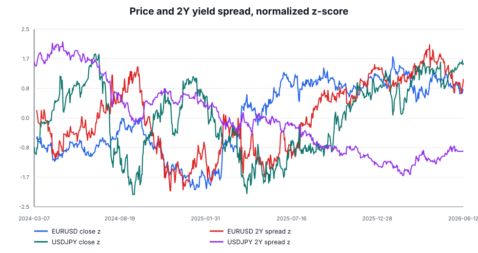
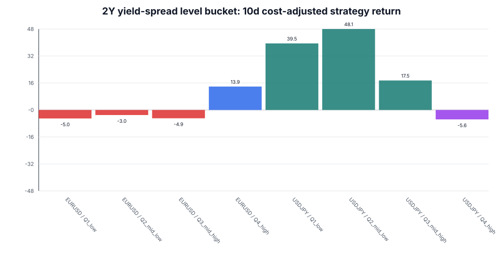
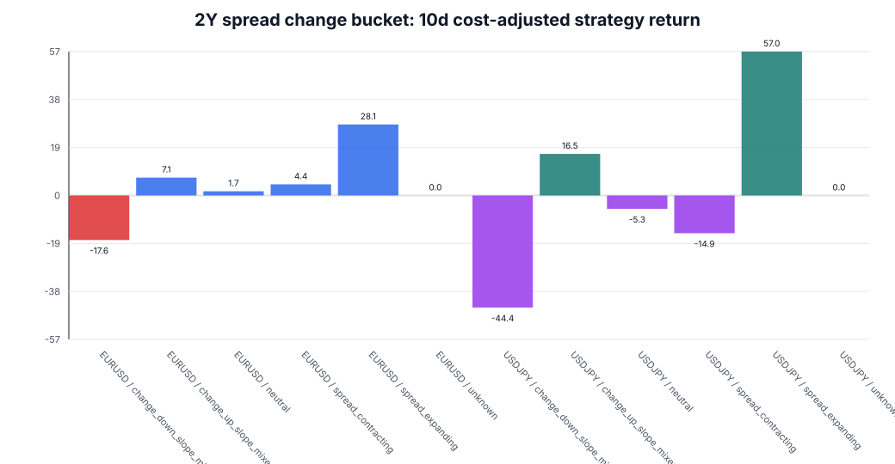
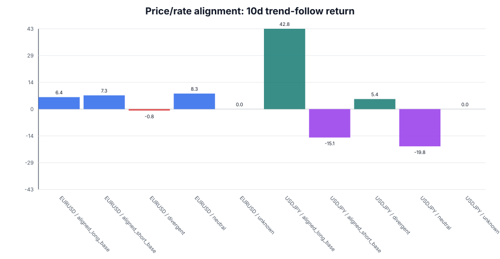
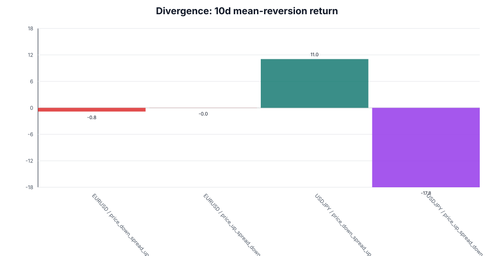
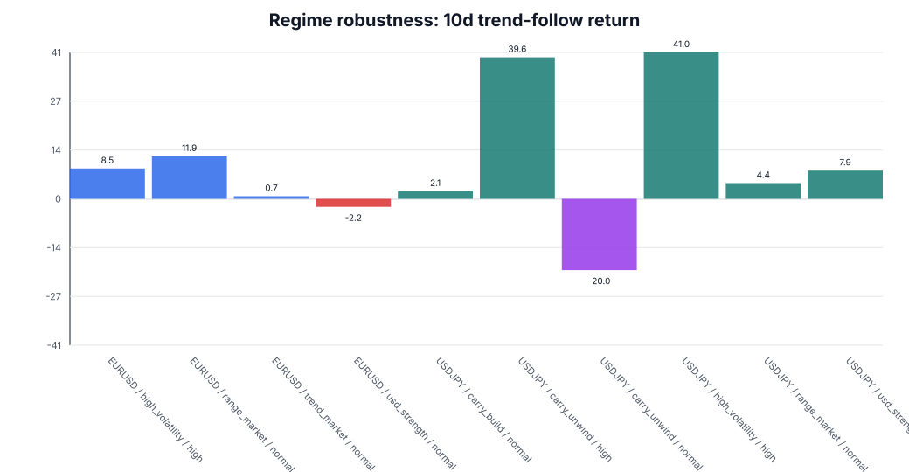

# FX 2年金利差フィルター実験レポート

## 結論

EURUSD と USDJPY の2ペアに絞れば、記事骨子に沿った検証は実施できる。ただし USDJPY は FX Nexus 標準DBのJPY履歴が当月分に限られるため、本実験では財務省公式の historical JGB CSV を lab_11 に保存して補助した。

実験の読み方は売買シグナルの採用ではなく、2年金利差が価格トレンドを支える局面、支えない局面、または追随を疑うべき局面を分けられるかを見る診断である。

## データ範囲

| type | name | rows | first | last | quality |
| --- | --- | --- | --- | --- | --- |
| sovereign_yield | EUR | 1277 | 2021-06-16 | 2026-06-12 | ok |
| sovereign_yield | JPY | 1210 | 2021-06-16 | 2026-05-29 | ok |
| sovereign_yield | USD | 1248 | 2021-06-16 | 2026-06-12 | ok |
| pair_yield_spread | EURUSD | 1232 | 2021-06-16 | 2026-06-12 | ok |
| pair_yield_spread | USDJPY | 1164 | 2021-06-16 | 2026-05-29 | ok |
| price_1d | EURUSD | 1555 | 2021-06-16 | 2026-06-12 | fx_nexus_ohlcv |
| price_1d | USDJPY | 1552 | 2021-06-16 | 2026-06-12 | fx_nexus_ohlcv |
| experiment_master | EURUSD | 1534 | 2021-06-17 | 2026-05-15 | leak_shifted_t_plus_1 |
| experiment_master | USDJPY | 1531 | 2021-06-17 | 2026-05-15 | leak_shifted_t_plus_1 |

## リーク防止

- T日の金利データはT+1以降にだけ使った。
- forward return は結合後の日次終値から5日、10日、20日先で計算した。
- `quality_status != ok` はマスターから除外した。
- USDJPY のJPY 2Y履歴は FX Nexus 設定済みMOF系ソースの historical CSV を補助入力として使い、raw CSVを保存した。
- 集計表の最大DDは、日次に重なるイベントリターンを累積した診断値であり、独立した実運用ポートフォリオDDではない。

## 図表













## 実験1: 金利差水準は効くか

水準テストは、金利差がプラスならbase通貨ロング、マイナスならbase通貨ショートという単純なキャリー方向で評価した。
これは記事内の「高金利通貨を買えばよいのか」を疑うための素朴なベースラインである。

| pair | yield_level_bucket | n | cost_adj_mean_5d_bp | cost_adj_mean_10d_bp | cost_adj_mean_20d_bp | strategy_win_rate_10d | strategy_sharpe_10d | strategy_max_dd_10d_bp |
| --- | --- | --- | --- | --- | --- | --- | --- | --- |
| EURUSD | Q1_low | 389 | -0.119 | -5.044 | -14.490 | 0.470 | -0.134 | 13473.907 |
| EURUSD | Q2_mid_low | 388 | -2.828 | -3.028 | -14.585 | 0.536 | -0.087 | 7677.894 |
| EURUSD | Q3_mid_high | 380 | -5.498 | -4.930 | -5.134 | 0.516 | -0.196 | 4733.975 |
| EURUSD | Q4_high | 377 | 7.554 | 13.887 | 38.852 | 0.554 | 0.738 | 3349.410 |
| USDJPY | Q1_low | 388 | 18.988 | 39.532 | 86.780 | 0.629 | 1.627 | 2875.880 |
| USDJPY | Q2_mid_low | 371 | 23.691 | 48.078 | 101.399 | 0.652 | 1.429 | 5067.021 |
| USDJPY | Q3_mid_high | 385 | 3.982 | 17.507 | 33.614 | 0.592 | 0.460 | 11214.205 |
| USDJPY | Q4_high | 387 | 2.031 | -5.601 | -17.405 | 0.579 | -0.137 | 10348.009 |

解釈: 水準だけの分類は、ペア内の状態差を見るには使えるが、単独で安定した売買根拠として扱うには弱い。特に水準が高い・低いことは、すでに価格へ織り込まれている可能性がある。

## 実験2: 金利差の変化は効くか

EURUSDで10日コスト控除後が最も良かった変化分類は `spread_expanding` (28.09bp)。USDJPYでは `spread_expanding` (56.98bp) だった。

| pair | rate_change_bucket | n | cost_adj_mean_5d_bp | cost_adj_mean_10d_bp | cost_adj_mean_20d_bp | strategy_win_rate_10d | strategy_sharpe_10d | strategy_max_dd_10d_bp |
| --- | --- | --- | --- | --- | --- | --- | --- | --- |
| EURUSD | change_down_slope_mixed | 77 | 13.328 | -17.623 | -29.008 | 0.481 | -0.513 | 3064.668 |
| EURUSD | change_up_slope_mixed | 70 | -13.577 | 7.093 | 41.246 | 0.500 | 0.263 | 1373.665 |
| EURUSD | neutral | 1049 | -2.271 | 1.673 | 0.990 | 0.500 | 0.089 | 4368.039 |
| EURUSD | spread_contracting | 179 | 7.070 | 4.408 | 32.356 | 0.536 | 0.177 | 3004.123 |
| EURUSD | spread_expanding | 153 | 26.407 | 28.092 | 25.031 | 0.595 | 1.226 | 1567.262 |
| EURUSD | unknown | 6 |  |  |  |  |  |  |
| USDJPY | change_down_slope_mixed | 89 | -27.344 | -44.356 | -96.276 | 0.360 | -1.459 | 3969.793 |
| USDJPY | change_up_slope_mixed | 106 | 24.940 | 16.455 | 45.101 | 0.594 | 0.516 | 2017.453 |
| USDJPY | neutral | 881 | 1.342 | -5.259 | 6.128 | 0.510 | -0.145 | 7203.972 |
| USDJPY | spread_contracting | 184 | -10.287 | -14.949 | -36.754 | 0.402 | -0.357 | 4469.703 |
| USDJPY | spread_expanding | 265 | 25.170 | 56.981 | 102.059 | 0.687 | 1.552 | 4150.024 |
| USDJPY | unknown | 6 |  |  |  |  |  |  |

解釈: 金利差の5日変化と20日傾きは、水準よりも「今どちらへ評価が変わっているか」を示す。記事では、絶対水準よりも変化方向を重視する説明に使える。

## 実験3: 価格と金利差の一致はトレンドフォロー向きか

EURUSDで10日トレンド追随が最も良かった分類は `neutral` (8.29bp)。USDJPYでは `aligned_long_base` (42.83bp) だった。

| pair | alignment | n | cost_adj_mean_5d_bp | cost_adj_mean_10d_bp | cost_adj_mean_20d_bp | strategy_win_rate_10d | strategy_sharpe_10d | strategy_max_dd_10d_bp |
| --- | --- | --- | --- | --- | --- | --- | --- | --- |
| EURUSD | aligned_long_base | 283 | 4.231 | 6.382 | -0.650 | 0.516 | 0.306 | 3079.441 |
| EURUSD | aligned_short_base | 331 | 8.828 | 7.327 | 21.989 | 0.520 | 0.322 | 2637.307 |
| EURUSD | divergent | 656 | 0.297 | -0.771 | -0.069 | 0.482 | -0.006 | 4626.408 |
| EURUSD | neutral | 244 | -1.316 | 8.293 | 18.612 | 0.500 | 0.298 | 3253.731 |
| EURUSD | unknown | 20 |  |  |  |  |  |  |
| USDJPY | aligned_long_base | 426 | 24.351 | 42.828 | 74.094 | 0.662 | 1.283 | 3364.361 |
| USDJPY | aligned_short_base | 272 | -3.156 | -15.147 | -33.166 | 0.438 | -0.362 | 5899.518 |
| USDJPY | divergent | 575 | 2.859 | 5.358 | -11.307 | 0.510 | 0.181 | 5408.140 |
| USDJPY | neutral | 238 | -5.705 | -19.842 | -24.463 | 0.475 | -0.615 | 5973.437 |
| USDJPY | unknown | 20 |  |  |  |  |  |  |

解釈: `aligned_long_base` / `aligned_short_base` は、価格トレンドと金利差トレンドが同じ方向を向く局面である。ここでトレンド追随の損益が改善するなら、2年金利差はエントリーシグナルではなく環境フィルターとして有用と言える。

## 実験4: 乖離は平均回帰向きか

| pair | divergence_pattern | n | cost_adj_mean_5d_bp | cost_adj_mean_10d_bp | cost_adj_mean_20d_bp | strategy_win_rate_10d | strategy_sharpe_10d | strategy_max_dd_10d_bp |
| --- | --- | --- | --- | --- | --- | --- | --- | --- |
| EURUSD | price_down_spread_up | 324 | 1.064 | -0.836 | -2.452 | 0.494 | -0.010 | 3984.437 |
| EURUSD | price_up_spread_down | 332 | -3.986 | -0.022 | 0.168 | 0.539 | 0.020 | 8220.268 |
| USDJPY | price_down_spread_up | 224 | 3.611 | 10.965 | 56.008 | 0.621 | 0.293 | 6905.588 |
| USDJPY | price_up_spread_down | 351 | -9.063 | -17.849 | -19.294 | 0.405 | -0.611 | 7744.627 |

解釈: divergent は即逆張りの合図ではない。むしろ、価格トレンドに追随する前に金利差で説明できる動きかを疑う警告信号として扱うのが実務的である。

## 実験5: レジーム別の効き方

| pair | regime | volatility_level | n | cost_adj_mean_5d_bp | cost_adj_mean_10d_bp | cost_adj_mean_20d_bp | strategy_win_rate_10d | strategy_sharpe_10d | strategy_max_dd_10d_bp |
| --- | --- | --- | --- | --- | --- | --- | --- | --- | --- |
| EURUSD | high_volatility | high | 228 | 11.907 | 8.481 | -3.723 | 0.496 | 0.311 | 2148.041 |
| EURUSD | range_market | normal | 374 | 4.460 | 11.901 | 26.540 | 0.511 | 0.446 | 3349.581 |
| EURUSD | trend_market | normal | 407 | 2.551 | 0.735 | 0.427 | 0.506 | 0.054 | 2900.692 |
| EURUSD | usd_strength | normal | 355 | -3.155 | -2.239 | 9.098 | 0.501 | -0.063 | 4589.044 |
| USDJPY | carry_build | normal | 72 | 4.588 | 2.126 | 11.942 | 0.500 | 0.074 | 3119.601 |
| USDJPY | carry_unwind | high | 67 | 46.992 | 39.598 | 48.340 | 0.522 | 0.837 | 1830.766 |
| USDJPY | carry_unwind | normal | 183 | -23.183 | -19.961 | -40.037 | 0.470 | -0.554 | 5556.619 |
| USDJPY | high_volatility | high | 168 | 25.505 | 40.959 | 61.835 | 0.613 | 1.093 | 5462.902 |
| USDJPY | range_market | normal | 133 | 22.080 | 4.394 | -7.158 | 0.526 | 0.130 | 3923.420 |
| USDJPY | trend_market | normal | 63 | 0.418 | 14.312 | 19.583 | 0.444 | 0.357 | 1806.881 |
| USDJPY | usd_strength | normal | 675 | 6.136 | 7.893 | 8.966 | 0.563 | 0.263 | 6143.162 |

解釈: トレンド、レンジ、高ボラ、キャリー巻き戻しでは、同じ金利差フィルターでも意味が変わる。高ボラや巻き戻し局面では、金利差よりもリスク管理と見送り判断を優先するべきである。

## 最新スナップショット

| pair | date | close | observation_date | base_yield_percent | quote_yield_percent | yield_spread_bp | spread_change_5d_bp | spread_slope_20d_bp_per_day | spread_z_252 | price_return_20d_bp | alignment | rate_trend_bias | regime | volatility_level | pair_residual_z_score | total_cost_bp | candidate_status |
| --- | --- | --- | --- | --- | --- | --- | --- | --- | --- | --- | --- | --- | --- | --- | --- | --- | --- |
| EURUSD | 2026-06-12 00:00:00 | 1.157 | 2026-06-11 00:00:00 | 2.609 | 4.050 | -144.106 | 2.730 | -0.509 | 0.537 | -77.854 | divergent | neutral | usd_strength | normal | 0.037 | 0.650 | ignore |
| USDJPY | 2026-06-12 00:00:00 | 160.228 | 2026-05-29 00:00:00 | 3.980 | 1.393 | 258.700 | -4.000 | 0.958 | -0.250 | 139.743 | divergent | neutral | usd_strength | normal | 0.277 | 0.700 | ignore |

## 記事への落とし込み

記事の中心メッセージは、次の形にできる。

> 2年金利差は売買シグナルではない。しかし、価格トレンドが金利市場に支えられているのか、金利差では説明しづらい需給・リスクオン・ポジション調整で動いているのかを分けるフィルターとして使える。

## 生成物

- `data/master_daily.csv`: 実験用マスターデータ
- `data/experiment_sample_daily.csv`: 20日先リターンまで計算できる検証サンプル
- `tables/*.csv`: 各実験の集計表
- `figures/*.svg`: 記事用図表
- `data/raw/*.csv`: FX Nexus由来データとMOF historical JGB CSV
- `experiment_metadata.json`: データソースとリーク防止設定

## メタデータ

```json
{
  "experiment_title": "FX 2Y yield-spread filter experiment",
  "pairs": [
    "EURUSD",
    "USDJPY"
  ],
  "since": "2021-06-16",
  "fx_nexus_root": "/Users/tikeda/workspace/fx_nexus",
  "fx_nexus_db": "/Users/tikeda/workspace/fx_nexus/var/fx_nexus.duckdb",
  "mof_jgb_historical_csv_url": "https://www.mof.go.jp/english/policy/jgbs/reference/interest_rate/historical/jgbcme_all.csv",
  "mof_jgb_page_url": "https://www.mof.go.jp/english/policy/jgbs/reference/interest_rate/index.htm",
  "leakage_rule": "T-day yield features are available from T+1; daily forward returns start from the merged price date.",
  "horizons_days": [
    5,
    10,
    20
  ],
  "master_rows": 3105,
  "experiment_sample_rows": 3065,
  "pair_feature_rows": 2396,
  "data_coverage": [
    {
      "type": "sovereign_yield",
      "name": "EUR",
      "rows": 1277,
      "first": "2021-06-16",
      "last": "2026-06-12",
      "quality": "ok"
    },
    {
      "type": "sovereign_yield",
      "name": "JPY",
      "rows": 1210,
      "first": "2021-06-16",
      "last": "2026-05-29",
      "quality": "ok"
    },
    {
      "type": "sovereign_yield",
      "name": "USD",
      "rows": 1248,
      "first": "2021-06-16",
      "last": "2026-06-12",
      "quality": "ok"
    },
    {
      "type": "pair_yield_spread",
      "name": "EURUSD",
      "rows": 1232,
      "first": "2021-06-16",
      "last": "2026-06-12",
      "quality": "ok"
    },
    {
      "type": "pair_yield_spread",
      "name": "USDJPY",
      "rows": 1164,
      "first": "2021-06-16",
      "last": "2026-05-29",
      "quality": "ok"
    },
    {
      "type": "price_1d",
      "name": "EURUSD",
      "rows": 1555,
      "first": "2021-06-16",
      "last": "2026-06-12",
      "quality": "fx_nexus_ohlcv"
    },
    {
      "type": "price_1d",
      "name": "USDJPY",
      "rows": 1552,
      "first": "2021-06-16",
      "last": "2026-06-12",
      "quality": "fx_nexus_ohlcv"
    },
    {
      "type": "experiment_master",
      "name": "EURUSD",
      "rows": 1534,
      "first": "2021-06-17",
      "last": "2026-05-15",
      "quality": "leak_shifted_t_plus_1"
    },
    {
      "type": "experiment_master",
      "name": "USDJPY",
      "rows": 1531,
      "first": "2021-06-17",
      "last": "2026-05-15",
      "quality": "leak_shifted_t_plus_1"
    }
  ]
}
```
