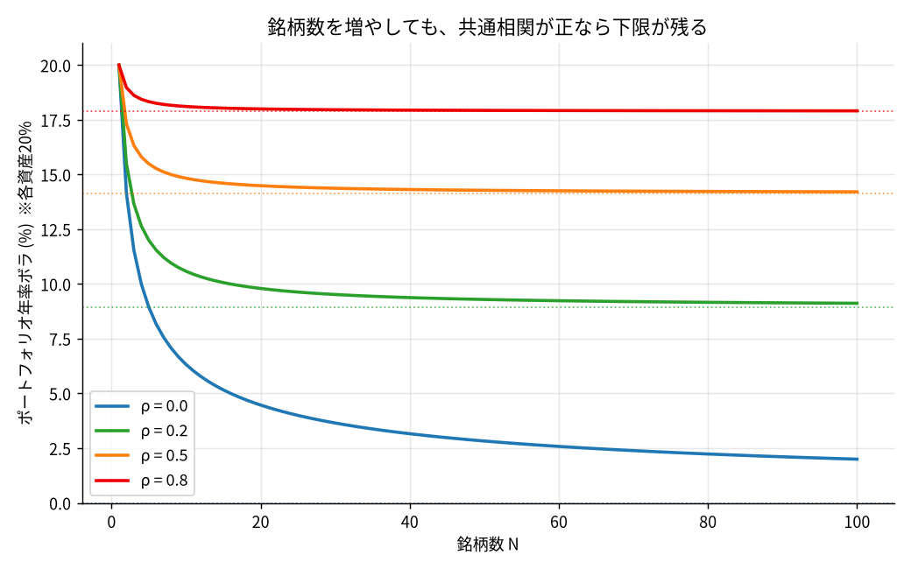
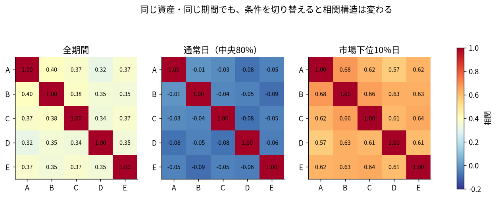
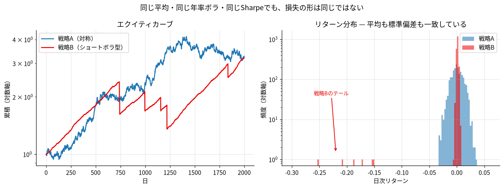
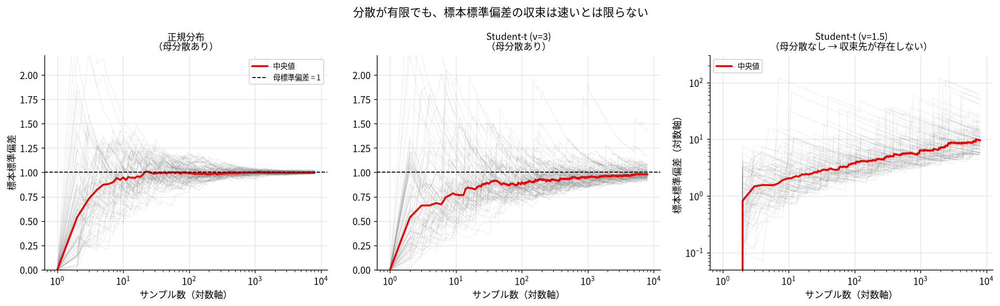
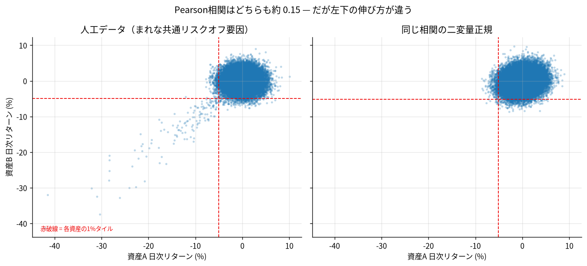
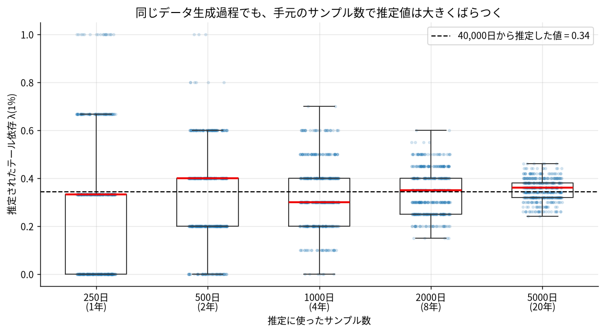

# 「分散したつもり」の罠 — 共分散とファットテールから考えるポートフォリオリスク

> 銘柄を増やせば分散になるわけではない。
> そして、分散・共分散を計算できればリスクが分かるわけでもない。

## この記事について

ポートフォリオ構築の入門記事は、たいてい「相関の低い資産を組み合わせましょう」で終わる。しかし実運用でポートフォリオが壊れるとき、壊れ方はもう少し具体的だ。**平時に低かった相関が危機時に上がる**、**戦略数は多いが実質的なリスク源は1つだった**、**標準偏差では捉えられない損失が一度に来る**、といった形をとる。

この記事では、実例（2022年の60/40、XIV、LTCM）を起点に、Markowitzの基本 → 共分散構造 → 危機時の相関変化 → ファットテール → テール依存 → 実務的なリスク管理、という順で整理していく。

各章は「現象 → 数式/概念 → 実務」の順で展開し、最後に再現用のPythonコードを置いた。

### 想定読者

- Pythonやバックテストには触れ始めているが、ポートフォリオ構築は「銘柄を増やせば分散」と捉えがちな入門クオンツ
- 相関係数やボラティリティは計算できるが、共分散行列・因子・テール依存・推定誤差まで一体として考えた経験が少ない方
- 最適化の数式よりも、「何が実際に壊れたのか」から直感を作りたい方

### この記事の到達点

> **分散とは保有数を増やすことではなく、独立した収益源と独立した損失原因を増やすことである。**

1. ポートフォリオ分散は、個別リスクの足し算ではなく共分散構造で決まる
2. 共分散は固定的な真実ではなく、危機時には構造そのものが変わり得る
3. 分散・標準偏差はリスクの一断面であり、ファットテール、ドローダウン、流動性、レバレッジは別に見る必要がある

### 全体の流れ

| 段階 | 実例・テーマ | 読者が得る理解 |
|---|---|---|
| 導入 | 2022年 60/40 | 「違う資産」でも同時に下がる |
| 基本 | 共分散の数式 | リスクは銘柄数では決まらない |
| クオンツ実務 | 複数EMA戦略 | 15戦略でも同じファクターなら1つの賭け |
| 危機時 | 下落時の相関 | 平時の共分散は固定ではない |
| ファットテール | XIV / Volmageddon | 低ボラ = 低リスクではない |
| 推定 | Normal vs Student-t | 分散の推定値自体が不安定になり得る |
| 複合危機 | LTCM | レバレッジと流動性が共通の壊れ方を作る |
| 発展 | テール依存 | 低相関でも同時暴落はあり得る |
| 実務 | 多面的リスク管理 | Varianceだけで終わらせない |

---

## 1. 導入：「株と債券なら分散できる」は本当か？ — 2022年の60/40

株式60%・債券40%は、最も広く使われている分散ポートフォリオの形だと思う。株式が下がる局面では債券が支える、という前提に立っている。

2022年は、この前提が同時に外れた年だった。インフレ高進に対する急速な利上げが進み、株式と債券が揃って下落した。

| 資産 | 2022年の年間トータルリターン |
|---|---|
| 米国株式（S&P 500） | 約 −18% |
| 米国総合債券（Bloomberg US Aggregate） | 約 −13% |
| 60/40ポートフォリオ | 約 −16%〜−17% |

（数値は使用する指数・データソースによって幅がある。State Streetは2022年の60/40を−16.7%、Morgan Stanleyは−17.5%としており、後者は1937年以来の最悪水準と位置づけている。ここでは「1〜2%の精度」ではなく「株も債券も二桁下落した」という事実を押さえてほしい）

重要なのは下落幅そのものではなく、**下落の理由が共通だった**ことだ。金利上昇は債券価格を直接押し下げると同時に、株式のバリュエーションも圧縮する。「株式」と「債券」という名前は違っても、この局面での損失ドライバーは同じ金利・インフレショックだった。

株式・債券の相関は、2000年代以降の低インフレ期には低い、あるいは負の領域にあることが多かった。それが2022年には正に転じた。State Streetの整理では、GFC後の10年間の平均相関が約−0.37だったのに対し、直近3年では約+0.41まで上昇している。つまり、**私たちが「分散効果」と呼んでいたものは、特定のマクロレジームに条件付けられた性質だった**可能性がある。

> **資産名が違うことと、損失原因が違うことは同じではない。**

この記事の残りは、この一文を数式と実例で分解していく作業になる。

---

## 2. ポートフォリオの基本：リターンは足し算、リスクは足し算ではない

ここだけは数式を出す。2資産ポートフォリオの分散は以下で表される。

$$
\sigma_p^2 = w_1^2\sigma_1^2 + w_2^2\sigma_2^2 + 2 w_1 w_2 \sigma_1 \sigma_2 \rho_{12}
$$

期待リターンは $\mu_p = w_1\mu_1 + w_2\mu_2$ で、素直な加重平均になる。しかしリスクはそうならない。第3項に $\rho_{12}$ が入っているからだ。

年率ボラ20%の資産を2つ、50:50で持ったときのポートフォリオボラを相関別に並べる。

| 相関 ρ | ポートフォリオボラ |
|---|---|
| +1.0 | 20.0% |
| +0.5 | 17.3% |
| 0.0 | 14.1% |
| −0.5 | 10.0% |
| −1.0 | 0%（理論上） |

同じ「2資産保有」でも、結果は0%から20%まで動く。**分散効果を作っているのは保有数ではなく相関である**、というのがMarkowitzの核心だと考えている。

### 銘柄数を増やすとどうなるか

同一ボラ $\sigma$・等ウェイト・全ペアの相関が $\rho$ で一定、というN資産を考えると、

$$
\frac{\sigma_p}{\sigma} = \sqrt{\rho + \frac{1-\rho}{N}}
$$

$N \to \infty$ のとき、右辺は $\sqrt{\rho}$ に収束する。つまり**共通相関が正である限り、銘柄をいくら増やしてもリスクには下限が残る**。

各資産のボラを20%として計算すると次のようになる。

| N | ρ=0.0 | ρ=0.2 | ρ=0.5 | ρ=0.8 |
|---|---|---|---|---|
| 1 | 20.00% | 20.00% | 20.00% | 20.00% |
| 2 | 14.14% | 15.49% | 17.32% | 18.97% |
| 5 | 8.94% | 12.00% | 15.49% | 18.33% |
| 10 | 6.32% | 10.58% | 14.83% | 18.11% |
| 20 | 4.47% | 9.80% | 14.49% | 18.00% |
| 50 | 2.83% | 9.30% | 14.28% | 17.93% |
| 100 | 2.00% | 9.12% | 14.21% | 17.91% |
| **∞（下限）** | **0.00%** | **8.94%** | **14.14%** | **17.89%** |



ρ=0.5のとき、N=10からN=100へ銘柄数を10倍にしても、ボラは14.83%から14.21%にしか下がらない。**銘柄数を10倍にして得られる分散効果より、共通相関を0.5から0.2に下げて得られる効果のほうがはるかに大きい**。

> **二銘柄持っていること自体ではなく、二銘柄が「同時にどう動くか」が分散効果を決める。**

---

## 3. 20銘柄あっても「一つの賭け」かもしれない

前章の $\rho$ を、クオンツの現場に翻訳する。

EUR/USD、USD/JPY、Gold、S&P500、BTCの5市場に、EMA50/200のクロス戦略を適用したとする。これで5戦略。さらにパラメータを振ってEMA40/160とEMA60/240も加えれば15戦略になる。バックテストのエクイティカーブは15本引ける。

だが、この15本は独立したリスク源だろうか。

| 戦略群 | 見かけ | 実質的な共通要因 |
|---|---|---|
| EMA40/160・50/200・60/240 | 3戦略 | 同じ中長期トレンド |
| EUR/USD・USD/JPY・Gold・BTC | 4市場 | Risk-on/off、USD、Momentumなどの共通因子 |
| 同一特徴量のMLモデル seed違い | 複数モデル | 同じデータ生成過程・同じ特徴量 |

> **パラメータの違いは、独立したエッジの証明ではない。**

### 因子モデルで書き直す

これはファクターモデルの言葉で整理できる。

$$
r = B f + \varepsilon, \qquad \Sigma = B \Sigma_f B^{\top} + D
$$

- $f$：共通因子（Trend、Carry、Risk-on/off など）
- $B$：各戦略の因子ローディング
- $\varepsilon$：戦略固有のノイズ、$D$ はその分散（対角）

分散投資で減らせるのは $D$ の部分だけだ。$B \Sigma_f B^{\top}$ は戦略数を増やしても消えない。EMAパラメータを振って作った15戦略は、$B$ がほぼ同じ方向を向いている。したがって $\Sigma$ の大部分は共通因子項で占められ、実効的な自由度は1に近い。

前章の式に戻すと、「共通因子で分散の70%が説明される」というのは実質的に $\rho \approx 0.7$ の世界にいるということだ。N=15なら $\sqrt{0.7 + 0.3/15} = 0.849$、つまり単一戦略の85%までしかボラは下がらない。N=1000でも $\sqrt{0.7} = 0.837$ が下限だ。**15戦略を作った労力の見返りは、ボラの15%削減にすぎない。**

### 実務的な確認方法

- 戦略群のリターン行列に主成分分析をかけ、第1主成分の説明割合を見る。第1主成分で70%説明できるなら、それは「1.4戦略」程度と考えたほうがいい
- 有効独立戦略数の目安として $N_{\text{eff}} = (\sum \lambda_i)^2 / \sum \lambda_i^2$（固有値のHerfindahl的な指標）を計算する
- 「パラメータを変えた」ではなく「損益ドライバーが違う」と説明できるかを、日本語で言語化してみる。言語化できないなら、たぶん同じ賭けだ

> **数えるべきなのは戦略数ではなく、独立した損益ドライバーの数である。**

---

## 4. 平時には分散できていたのに、なぜ危機時に壊れるのか

ここまでは $\rho$ を定数として扱ってきた。実際にはそうではない。

株式市場の相関には非対称性があることが繰り返し報告されている。Ang & Chen (2002) は米国株ポートフォリオにおいて下落局面の相関が上昇局面より高いことを示し、Longin & Solnik (2001) は国際株式市場において極端な下落局面で相関が高まる一方、極端な上昇局面では同様の上昇が見られないことを報告している。

これを人工データで再現してみる（詳細なコードは後述）。5資産、2500日、通常時は共通因子への負荷が小さく、まれに訪れるストレス期だけ負荷が大きくなる、というレジームスイッチのデータを作った。

| 条件 | 日数 | 平均ペア相関 |
|---|---|---|
| 全期間 | 2500 | **0.36** |
| 通常日（市場リターン中央80%） | 2000 | **−0.05** |
| 市場上位10%日 | 250 | 0.23 |
| 市場下位10%日 | 250 | **0.63** |



全期間の平均相関は0.36。この数字だけを見て「ほどよく分散できている」と判断すると、通常日は実質無相関（−0.05）で、市場が下位10%に沈む日は0.63まで上がる、という構造を見落とす。

**この0.36という数字は、どの日にも当てはまらない。**平時にも当てはまらないし、危機時にも当てはまらない。2つの異なるレジームを平均した結果、どちらの実態も表していない値になっている。

なお、条件付き相関の比較には注意点がある。「大きく動いた日だけを抜き出す」というサンプリング自体が、真の相関が一定でも相関推定値を押し上げるバイアスを持つ（selection bias）。したがって「下落日の相関が高かった」だけでは非対称性の証拠にならない。Longin & Solnikはこの点を極値理論の枠組みで扱っており、単純な条件付き相関の比較を超えた検定を行っている。手元の分析で条件付き相関を見るときは、少なくとも「上昇日の相関」も並べて、対称的に上がっていないかを確認しておきたい。

### 実務的な切り分け

- 全期間の相関だけでなく、上昇日・下落日・高ボラ日・危機期間で条件付き相関を比較する（上昇日も必ず並べる）
- ローリング相関の窓長を60日・120日・250日と変え、推定値が窓長に対して安定しているか確認する
- ストレス期の共分散行列 $\Sigma_{\text{stress}}$ を別に推定し、通常時の $\Sigma_{\text{normal}}$ だけで最適化しない
- 最小分散ポートフォリオを組むなら、$\Sigma_{\text{normal}}$ で組んだ解を $\Sigma_{\text{stress}}$ で評価してみる

> **平均相関0.3という一つの数字の中に、「平時は低いが危機時は高い」という構造が隠れている。**

---

## 5. ファットテール：「標準偏差16%」は何を意味するのか

ここから論点を移す。前章までは「共分散を正しく理解する」話だった。ここからは「分散・標準偏差をリスクそのものとみなすことの危険性」の話になる。

2つの戦略を作った。

- **戦略A**：利益と損失が対称。普通のランダムウォーク
- **戦略B**：普段は小さく確実に勝つが、ごくまれに壊滅的な損失が出る（ショートボラ型）

戦略Aは、標準正規乱数を標本平均0・標本SD1に再標準化したうえで、戦略Bの**実現**平均・**実現**標準偏差に合わせてある。つまり2,000日の実現日次平均も実現日次SDも小数点以下まで一致しており、リスクフリー0のSharpeは定義上まったく同じになる。**両者の差はすべて「分布の形」に由来する。**

| 指標 | 戦略A（対称） | 戦略B（ショートボラ型） |
|---|---|---|
| 年率ボラ | 16.86% | 16.86% |
| Sharpe (rf=0) | 0.97 | 0.97 |
| 勝率 | 50.7% | **79.1%** |
| 歪度 | 0.02 | **−18.58** |
| 超過尖度 | −0.06 | **362.9** |
| ES(5%) 日次 | −2.13% | **−1.32%** |
| ES(1%) 日次 | −2.80% | **−5.86%** |
| 最大損失（1日） | −3.17% | **−25.28%** |
| 最大損失（5日） | −6.44% | −32.44% |
| 最大損失（20日） | −11.65% | −31.84% |
| 最大DD | −26.17% | −43.63% |
| 最大DD区間の長さ | 446日 | 481日 |
| 最大DD区間内の最悪1日 | −3.12% | **−25.28%** |
| └ 区間の対数損失に占める割合 | 10.5% | **50.8%** |

補足を2つ。

- **最後の行の定義**：最大DDのピーク〜ボトム区間を特定し、その区間内の最悪1日の対数損失を、区間全体の対数損失で割った値。対数なら加法的に分解できるので寄与率として扱える。単純リターンを最大DDで割った比とは別物なので注意
- **年率リターンは完全一致しない**（16.06% 対 15.81%）。揃えたのは算術平均であり、複利で効いてくる幾何平均は分布形状によってずれる。これ自体が「同じ算術平均でも壊れ方が違えば結果も違う」という本章の主張の一例になっている



注目してほしい点が3つある。

**1. 標準的な指標では、戦略Bのほうが優秀に見える。** リターンもボラもSharpeも一致しているうえに、勝率は79%対51%、ES(5%)も−1.32%対−2.13%で戦略Bが上回る。この5行だけのレポートを見せられたら、多くの人は戦略Bを選ぶと思う。

**2. ES(1%)まで深く見て、初めて逆転する。** −5.86% 対 −2.80%、約2倍。5%分位で切ると、戦略Bの普段の小さな損失しか拾えない。**テールの閾値をどこに置くかで結論が反転する**、というのはESを使う際の実務上の注意点だ。

**3. 決定的な差は、損失が積み上がるのか、一度に来るのかにある。** 最大損失の3行が分かりやすい。

| 期間 | 戦略A | 戦略B |
|---|---|---|
| 1日 | −3.17% | −25.28% |
| 5日 | −6.44% | −32.44% |
| 20日 | −11.65% | −31.84% |

戦略Aは期間を延ばすほど損失が積み上がる（1日の3.7倍が20日）。戦略Bは1日と20日でほとんど変わらない。**戦略Bにとって最大損失とは、実質的にあの1日のことだ。**

最大DDの区間長は446日対481日でほぼ同じなのに、戦略Aはその区間の対数損失のうち最悪1日が占めるのが10.5%、戦略Bは50.8%。同じ長さの下落局面でも、片方は数百日かけて削られ、もう片方は半分が単一の日で作られている。前者なら途中でポジションを落とす余地があるが、後者にはその時間がない。

| 指標 | 何を見るか | 弱点 |
|---|---|---|
| Volatility / Variance | 平均周辺の散らばり | 方向性・経路・テールを表さない |
| Skewness / Kurtosis | 非対称性・厚い裾 | 標本推定が極めて不安定 |
| Expected Shortfall | 損失側テール | 閾値と標本数に強く依存 |
| Maximum Drawdown | 実際の損失経路 | 単一経路依存でサンプルに敏感 |
| 期間別の最大損失 | 損失が積み上がるか一度に来るか | 単一経路の実現値にすぎない |

> **分散は「どれだけ散らばるか」を測るが、「どの方向へ、どれほど極端に壊れるか」までは測らない。**

---

## 6. 実例：XIV — 「普段は静か」が安全とは限らない

前章の戦略Bは人工データだが、現実にほぼ同じ形の事故が起きている。

2018年2月5日、VIXは前日終値17.31から37.32へ上昇した。1日で約115%の上昇であり、VIX史上最大の1日上昇幅だった。

このとき、逆VIX ETNであるXIV（VelocityShares Daily Inverse VIX Short-Term ETN）の指標価値は1日で90%超下落した。XIVは通常取引時間中は14%程度の下落にとどまっていたが、時間外取引で急落し、80%以上下落した水準まで到達した。目論見書には1日の下落が80%以上になった場合に発行体が早期償還を実行できる条項（acceleration event）が含まれており、Credit Suisseは翌2月6日に早期償還を発表。XIVは2月中に償還され、償還価額は1口あたり6ドル前後だった。直前の終値は100ドル近辺である。

Augustin, Cheng, Van den Bergen (2021) の分析によれば、この崩壊の背景にはショートボラ型ETPのリバランス機構がある。ボラティリティが急騰するとETPの純資産は減少するが、ショートVIX先物ポジションの想定元本は相対的に膨らむ。市場中立を維持するにはVIX先物を買い戻す必要があり、その買いがVIX先物価格をさらに押し上げ、ETPの純資産をさらに減らす、というフィードバックループが生じた。ETPがVIX先物市場で大きなシェアを占めていたことが、このループを増幅した。

### この事例をどう使うか

XIVを「特殊な商品事故」として片付けると、教訓の射程が狭くなる。ここで見るべきは損益の形状だ。

- 普段は小さく安定して稼ぐ（コンタンゴによるロールイールド）
- 実現ボラは長期にわたって低い
- しかし、まれに来るイベントで元本のほぼ全額を失う

この形状は、ショートボラだけの専売特許ではない。**キャリートレード、流動性供給、CDSの売り、レンジ相場向けのメリバ戦略、ペアトレードのスプレッド収束狙い**など、「平時の小さな収益と、まれな大損」という構造は広く存在する。

そしてこの形状は、**バックテスト期間中にイベントが1回も起きなければ、極めて優秀な戦略に見える**。前章の戦略Bは、2,000日のうちブロー日が6日あった。この6日を取り除くとどうなるか、実際に計算してみる。

| | 全期間（2,000日） | ブロー日6日を除外（1,994日） |
|---|---|---|
| 年率リターン | 15.81% | 35.74% |
| 年率ボラ | 16.86% | **2.40%** |
| Sharpe | 0.97 | **12.75** |
| 最大DD | −43.63% | **−0.78%** |
| 最悪の1日 | −25.28% | −0.54% |

**全体の0.3%にあたる6日を外すだけで、年率ボラは7分の1、Sharpeは13倍になる。**もしバックテスト期間にこの6日が1日も含まれていなければ、これは「年率35%、ボラ2.4%、最大DD 0.8%」の戦略として報告されることになる。

> **過去の変動の小ささと、将来の最大損失の小ささは同義ではない。**

---

## 7. 分散が存在しても、安定して推定できるとは限らない

ここまで「分散はリスクの一断面にすぎない」と書いてきた。もう一段深い問題がある。**そもそも、その分散を安定して推定できているのか**という問題だ。

### 単発ショックが標本ボラに与える影響

999日間、日次標準偏差0.3%（年率約4.7%）で推移した系列を作り、1000日目に−15%を1回だけ加える。

```
999日までの年率ボラ : 4.71%
1000日目に -15% 追加: 8.88%
倍率               : 1.88x
```

たった1日で、標本ボラが1.88倍になる。逆に言えば、**「年率ボラ4.71%」という推定値は、まだ起きていない1日を含んでいないだけかもしれない**。

### Normal vs Student-t：収束はする。ただし遅い

ここで、よくある2つの主張を区別しておきたい。

- **一致性**：サンプル数を増やせば推定値が真値に近づくか
- **収束の速さ**：どれくらいのサンプル数で、どこまで狭まるか

Student-t（ν=3）は**母分散が有限**なので、標本標準偏差は一致推定量だ。つまりサンプルを増やせば母標準偏差に収束する。この点は正規分布と変わらない。

問題は速さのほうにある。ν=3では4次モーメントが無限大になるため、標本分散の標本分布の分散が有限にならない。結果として、**通常の $\sqrt{n}$ 正規近似も、分散ベースの標準誤差評価も使えない**。

分散1に正規化した両分布から、各4,000パス・最大8,000サンプルを生成し、3つのシードで平均した結果が以下になる。分位点ベースのほうが外れ値に頑健なので、5〜95%レンジで比較する。

| サンプル数 | 正規分布：レンジ | 幅 | Student-t(ν=3)：レンジ | 幅 |
|---|---|---|---|---|
| 100 | [0.883, 1.116] | 0.233 | [0.714, 1.337] | 0.623 |
| 250 | [0.926, 1.073] | 0.147 | [0.788, 1.274] | 0.486 |
| 500 | [0.947, 1.051] | 0.103 | [0.829, 1.211] | 0.382 |
| 1000 | [0.964, 1.036] | 0.072 | [0.863, 1.169] | 0.306 |
| 2000 | [0.974, 1.026] | 0.052 | [0.890, 1.139] | 0.249 |
| 4000 | [0.982, 1.018] | 0.036 | [0.913, 1.113] | 0.200 |
| 8000 | [0.987, 1.013] | 0.026 | [0.930, 1.090] | 0.159 |

**どちらも縮み続ける。**ν=3の推定値が収束しないわけではない。しかし縮む速さがまったく違う。

サンプル数を100から8,000へ80倍にしたとき、

- 正規分布：幅が 0.233 → 0.026、**約9分の1**（$\sqrt{80} \approx 8.9$ とほぼ一致）
- Student-t(ν=3)：幅が 0.623 → 0.159、**約3.9分の1**

正規分布は理論どおり $n^{-1/2}$ で縮んでいる。ν=3のほうは、実測の指数がおよそ $n^{-1/3}$ だ。これは偶然ではなく、テール指数 $\alpha$ が $2 < \alpha < 4$ のとき、標本分散の収束レートが $n^{-1/2}$ ではなく $n^{-(1-2/\alpha)}$ になるという既知の結果と一致する（$\alpha = 3$ なら $n^{-1/3}$）。

実務的な含意はこうなる。

> **推定誤差を半分にするために、正規分布なら4倍のデータで済む。ν=3では8倍必要になる。**

2,000営業日（約8年）の時点でも、ν=3の推定値には [0.890, 1.139] の幅がある。これを半分に狭めるには16,000営業日、つまり**約63年分**のデータが要る。



### 「遅い収束」と「収束しない」は別物

比較のため、ν=1.5（母分散が**存在しない**）も並べた。

| サンプル数 | 中央値 | 5〜95%レンジ |
|---|---|---|
| 100 | 3.568 | [2.060, 13.213] |
| 500 | 4.891 | [2.997, 17.572] |
| 2000 | 6.285 | [4.008, 22.717] |
| 8000 | 8.006 | [5.185, 27.094] |

**中央値がサンプル数とともに増え続ける。**収束先が存在しないので、データを足すほど推定値が大きくなる。ν=3の「遅いが縮む」とは、質的に異なる現象だ。

株式リターンのテール指数 $\alpha$ については3〜5程度、暗号資産や一部のクレジット関連ではさらに低いという推定が報告されることが多い。つまり多くの金融時系列は、**ν=1.5の非収束ではなく、ν=3の「遅い収束」の帯**にいる可能性が高い。分散は存在する。推定もできる。ただし、精度が上がるのは想像よりずっと遅い。

### 共分散行列ではさらに悪化する

これは共分散行列にも波及する。N資産、T期間で標本共分散行列を推定するとき、推定すべきパラメータは $N(N+1)/2$ 個ある。N=50なら1,275個。T=1,000でも、1パラメータあたり実効的なサンプルは1つに満たない。最小分散最適化はこの誤差を最大限に増幅する方向に働くことが知られており、Ledoit & Wolf のShrinkage推定量はまさにこの問題への対処として提案されている。

### 実務的な対処

- 標本共分散をそのまま最適化に投入しない。Shrinkage（Ledoit-Wolf）、因子モデル、あるいは相関行列を単純化した構造（等相関など）を検討する
- ボラ推定値には点推定ではなく**分位点ベースの**信頼区間を付ける。標準誤差ベースの区間は、ファットテール下では前提が壊れている
- 「1回の大きな観測値を除いたらボラがどう変わるか」を必ず計算する。1点への感応度が高いなら、その推定値は将来を語る根拠にならない
- 「データを増やせば解決する」という発想を捨てる。$n^{-1/3}$ の世界では、データ量で買える精度には限りがある

> **「ボラ12.3%」という精密な数字が出ても、その推定自体が精密とは限らない。**

---

## 8. 実例：LTCM — 違う市場に分散していたのに、なぜ同時に壊れたのか

共分散、ファットテール、レバレッジ、流動性。これらが1つの事例に統合されているのがLTCMだ。

LTCMは1994年、Salomon Brothersの債券アービトラージ責任者だったJohn Meriwetherによって設立された。パートナーにはMyron Scholes、Robert Merton（ともに1997年ノーベル経済学賞）、元FRB副議長のDavid Mullinsが名を連ねていた。

ポートフォリオは、米国債、モーゲージ担保証券、株式、スワップ、新興国債券など多岐にわたっていた。**資産クラスの観点では、これ以上ないほど分散されているように見えた。**

1997年末、LTCMは運用機会に比べて資本が大きすぎると判断し、27億ドルを外部投資家に返還した。資本は47億ドルに減ったが、ポジションサイズは維持されたため、バランスシート上のレバレッジは約25:1から約28:1に上昇した。

1998年8月17日、ロシアがルーブル建て国内債務のデフォルトと通貨切り下げを実施する。LTCMのロシア直接エクスポージャー自体は致命的ではなかったが、二次的影響が壊滅的だった。世界的なFlight to Qualityが発生し、投資家は一斉にリスク資産を売って最も安全な資産に逃げた。

**LTCMのポジションは、市場も商品も違ったが、ほぼすべてが「スプレッドが収束する」方向に賭けていた。** Flight to Qualityの局面では、あらゆるスプレッドが逆方向、つまり拡大方向に動く。LTCMのポジションはほぼ例外なく同時に逆行した。

1998年8月だけで18.5億ドル、資本の約44〜45%を失う。8月21日の1日で5.53億ドルを失った。9月中旬には資本が約6億ドルまで減少する一方、バランスシート上の資産は1000億ドル超のままで、実効レバレッジは約167:1に達した。

ここから自己増幅ループが始まる。資本が減る → 追証が発生する → ポジションを縮小せざるを得ない → 流動性の低い市場で投げ売りする → 価格がさらに逆行する → 資本がさらに減る。

9月23日、ニューヨーク連銀の仲介のもと、14の金融機関による約36億ドルの民間資本注入で合意。公的資金は使われていない。目的はLTCM自体の救済というより、1000億ドル超のポートフォリオが無秩序に清算されることによる連鎖的な市場崩壊を防ぐことにあった。1998年の4か月足らずで失われた資本は約46億ドルとされる。

### LTCMから切り出す4つの論点

| 論点 | 読み替え |
|---|---|
| 表面的な分散 | 市場・商品が違っても、同じ「収束仮説」に依存していた |
| レバレッジ | 小さな価格誤差を巨大な損失に変換する。25:1では1%の逆行が資本の25%を消す |
| 流動性 | 売りたい時に売れないこと自体がリスク。流動性は共通因子である |
| 強制売却 | 危機時に資産間の共動を高める内生的メカニズム |

最後の点が、この記事の文脈で最も重要だと考えている。**共分散は市場が外から与えてくる定数ではない。市場参加者の資金制約とポジションが、危機時に新しい共分散構造を作り出す。** 相関がゼロだった2つのポジションでも、それらを両方持っているレバレッジ主体が同時に投げ売りを迫られれば、その瞬間に相関は1に近づく。

これは第4章で見たレジーム依存の相関の、メカニズムの側からの説明でもある。相関が上がるのは偶然ではなく、危機時には**資金制約が共通のリスク因子として支配的になる**からだ。

> **金融市場では、危機そのものが新しい共分散構造を作ることがある。**

---

## 9. 低相関なら大丈夫なのか？ — 相関とテール依存は違う

ここまで「相関を下げよう」という方向で話を進めてきた。最後にその前提自体を検討する。

### まず、保険の話から

保険会社が10万件の火災保険を引き受けたとする。ある家が火事になる確率は年に0.03%程度だ。そして重要なのは、**A家の火事とB家の火事はほぼ独立している**こと。隣家に燃え移ることはあっても、100km離れた家には関係ない。だから大数の法則が効く。年間の支払件数はほぼ予測でき、必要な準備金も計算できる。

次に、同じ会社が10万件の地震保険を引き受けたとする。1件あたりの倒壊確率は火災と同程度かもしれない。過去10年のデータを取っても、「A家の倒壊」と「B家の倒壊」の相関はほぼゼロに見えるだろう。**地震が起きていない期間のデータだけなら、火災保険とまったく同じ統計に見える。**

しかし地震が来た日、同じ地域の10万件が同時に壊れる。

火災保険と地震保険は、平常時の統計ではほとんど区別がつかない。それでも保険会社は両者をまったく違うものとして扱う。火災はプールすれば消えるリスクだが、地震はプールしても消えない。**プールで消えるリスクと消えないリスクを、平均的な相関係数は区別しない。**

ポートフォリオでも同じことが起きる。

### 実際に起きたこと：2020年3月

2020年2月末、市場は教科書どおりに動いていた。株価が下落する一方、米国債利回りは約100bp低下し、金は約4%上昇した。典型的な flight to safety であり、分散投資が想定どおりに機能していた局面だ。

ところが3月9日から18日にかけて、様相が一変する。株も、米国債も、金も、同時に下落した。金はこの週に9.3%下落し、2011年以来最悪の週となった。3月9日から19日にかけての下落幅は約12%。安全資産のはずの米国債も売られ、市場機能そのものに支障が出た。

金融安定理事会（FSB）の事後検証では、この局面が「dash for cash」と呼ばれている。通常のストレス局面では株が下がって国債が上がるが、このときは両方が大きく下落した。**普段は安定している国債や金までもが、それまでの値上がり分を換金する対象になった**からだ。背景には、ボラティリティ急上昇に伴う追証の急増があった。

要するに、こういうことが起きた。

> ポジションが損失を出す → 追証が発生する → 現金が必要になる → **売りたいものではなく、売れるものを売る**

このとき、資産の間に何のファンダメンタルな関係がなくても、「同じ投資家が同時に保有していて、同時に換金を迫られる」というだけで、価格は同時に下がる。第8章のLTCMで見たメカニズムと同じものが、2020年3月には市場全体の規模で起きた。

ここで押さえてほしいのは次の点だ。**2020年3月以前の20年分のデータで金と株の相関を計算しても、この現象は見えない。**相関はゼロ近辺か、むしろマイナスだったはずだ。それでも最悪の10日間には、相関は1に近づいた。

### なぜ相関係数では見えないのか

Pearson相関は $E[(A-\mu_A)(B-\mu_B)] / (\sigma_A \sigma_B)$ という「全期間を平均した」指標だ。

2000営業日のうち、共同暴落が10日あったとする。この10日の積 $(A-\mu_A)(B-\mu_B)$ は確かに大きいが、**日数としては全体の0.5%の重みしか持たない**。残り1990日の穏やかな関係が、平均値を支配する。

一方、テールでの条件付き確率は、まさにその10日だけを見る指標だ。

$$
\lambda_L(p) = P\big(B \le q_p^B \;\big|\; A \le q_p^A\big)
$$

「Aが下位 $p$ % に沈んだ日、Bも下位 $p$ % に沈んでいる確率」である。$p$ を小さくしていくと、平均が支配していた領域から離れ、最悪の日だけを見ることになる。

**相関係数は「ふだんの関係」を、テール依存は「非常時の関係」を測る。**この2つは別の量であり、片方から片方は導けない。

### 人工データで切り出す

現実のデータでは、レジーム変化・ボラティリティクラスタリング・マクロ要因が混ざり合っているため、「テール依存だけ」を取り出して見ることが難しい。そこで、この構造だけを最小限に切り出した人工データを作る。

設計は保険のたとえに対応させた。

| | 保険 | この人工データ |
|---|---|---|
| 99.5%の日 | 通常損害（各家が独自の理由で火事になる） | AとBが**独立**に日次ボラ2%で動く |
| 0.5%の日（平均200営業日に1日） | カタストロフィ（同じ地震が全部を襲う） | 共通のリスクオフ要因 $g$ にAもBも反応する |

0.5%は各営業日ごとの確率で、**平均すると約200営業日に1日**（1,000営業日なら約5日）にあたる。共通要因 $g$ の大きさは指数分布に従わせてある。つまり「軽いリスクオフ」から「歴史的暴落」まで連続的に分布し、**きれいに分離した塊にはならない**。ここは現実の市場に寄せた設計にしている。

比較対象として、**同じ平均・同じ分散・同じPearson相関を母数に設定した**二変量正規からもデータを生成した。新しい有限標本なので実現値は完全一致ではなくほぼ一致（相関 0.154 対 0.162、年率ボラ 26.33% 対 26.43%）になるが、2次モーメントまでの情報で見分けがつかない2つの世界を並べる、という趣旨は変わらない。

40,000日（約160年）分を生成した結果が以下になる。

| 指標 | 人工データ | 同じ相関の二変量正規 |
|---|---|---|
| Pearson相関 | +0.154 | +0.162 |
| $\lambda_L(10\%)$ | 0.136 | **0.154** |
| $\lambda_L(5\%)$ | 0.125 | 0.083 |
| $\lambda_L(1\%)$ | **0.343** | 0.033 |
| $\lambda_L(0.5\%)$ | **0.575** | 0.010 |
| 下方相関（両者が中央値未満の日） | +0.614 | +0.068 |
| 等ウェイトPF 年率ボラ | 26.33% | 26.43% |
| 等ウェイトPF ES(1%) 日次 | −7.08% | −4.47% |
| 等ウェイトPF **最悪日** | **−41.69%** | **−6.96%** |



**Pearson相関はどちらも約0.15。ポートフォリオの年率ボラも26.3%台で一致している。**平均・分散・相関という2次モーメントまでの情報では、この2つはほとんど区別できない。

にもかかわらず、ポートフォリオの最悪日は **−41.69% 対 −6.96%**。6倍の差だ。

散布図を見ると違いは一目瞭然で、人工データ側には左下に向かって細く伸びる尾がある。二変量正規側にはこれがない。

### 閾値の深さで結論が反転する

この表で最も実務的に重要なのは、$\lambda_L$ の行だ。

| 閾値 $p$ | 人工データ | 二変量正規 |
|---|---|---|
| 10% | 0.136 | 0.154 ← **正規のほうが高い** |
| 5% | 0.125 | 0.083 |
| 1% | 0.343 | 0.033 |
| 0.5% | 0.575 | 0.010 |

**$p=10\%$ で切ると、危険なほうのデータのほうが「安全に見える」。**ここだけを見て「テール依存はない」と結論すると、完全に逆の判断になる。

見るべきは水準ではなく**傾き**だ。$p$ を小さくしていったとき、

- **上がっていく**（0.136 → 0.125 → 0.343 → 0.575）→ テール依存がある
- **下がっていく**（0.154 → 0.083 → 0.033 → 0.010）→ テール依存がない

多変量正規分布（ガウシアンコピュラ）は、$\rho < 1$ である限り $p \to 0$ で $\lambda_L \to 0$ という性質を持つ。つまり**相関行列を推定して多変量正規を仮定した時点で、テール依存はモデルからゼロとして排除される**。2008年の証券化商品の評価でガウシアンコピュラが批判されたのは、この性質による。

### では、実データでこれを推定できるのか

ここが、この章で最も伝えたい部分だと考えている。

上の実験は40,000日、約160年分のデータで回した。だから0.5%の事象が200日近く入り、$\lambda_L$ がはっきりした数字として出た。**しかし実データで手元にあるのは、多くの場合2,000〜5,000日（8〜20年）だ。**

そこで、同じデータ生成過程から一定期間を切り出し、$\lambda_L(1\%)$ を推定する実験を500回繰り返した。真値の目安は0.343である。

| サンプル数 | 年数 | 推定値の中央値 | 5〜95%レンジ | **0と推定した割合** |
|---|---|---|---|---|
| 250日 | 1.0年 | 0.333 | [0.000, 0.667] | **37.8%** |
| 500日 | 2.0年 | 0.400 | [0.000, 0.600] | **12.2%** |
| 1000日 | 4.0年 | 0.300 | [0.100, 0.600] | 1.4% |
| 2000日 | 7.9年 | 0.350 | [0.200, 0.500] | 0.0% |
| 5000日 | 19.8年 | 0.360 | [0.260, 0.420] | 0.0% |



1年分のデータでは、**37.8%の確率で「テール依存はゼロ」という結論が出る。**真値が0.343であるにもかかわらずだ。

理由は単純で、250日の1%タイルは2〜3日しかない。その2〜3日にたまたま共同暴落が入っていなければ、推定値は0になる。8年分（2000日）を使ってようやくゼロは出なくなるが、それでもレンジは [0.20, 0.50] で、2.5倍の開きがある。

**「データで確認できなかった」は「存在しない」を意味しない。**第7章で見た標本分散の推定不安定性と同じ構造の問題が、テール依存ではさらに深刻な形で現れる。分散の推定には全サンプルが使えるが、テール依存の推定に使えるのは全体の1%だけだからだ。

### この人工データが現実と違うところ

上の実験は構造を切り出すための道具であり、現実の市場の模型ではない。少なくとも次の3点で現実と異なる。

**1. 現実の共同暴落は1日で終わらない。** 2020年3月の「dash for cash」は3月9日から18日にかけて続いた。この人工データは各日が独立で、悪い日が連続して来ることはない。実際の市場にはボラティリティ・クラスタリングがあり、悪い日は固まって来る。したがって現実のドローダウンは、この実験が示すよりさらに深くなり得る。

**2. 現実には「通常日」と「暴落日」の境目がない。** この人工データは2つの状態の混合だが、実際には第4章で見たように相関は連続的に変化する。実データの散布図には、これほどはっきりした尾は見えないことが多い。むしろ「なんとなく左下が厚い」程度にしか見えず、だからこそ数値で確認する必要がある。

**3. 現実の共同ショックは毎回違う顔をする。** この実験では共通要因 $g$ が常に同じ形で作用するが、2008年と2020年と2022年では、何が同時に壊れたかが違う。過去のテール依存を推定して未来に当てはめること自体に、構造変化のリスクがある。

つまり、この実験から持ち帰るべきは「テール依存係数を推定しよう」ではない。**推定は当てにならない、という認識のほうだ。**

### 実務ではどうするか

推定に頼れないなら、別のアプローチが必要になる。

**(1) 推定するのではなく、シナリオとして直接置く**

$\lambda_L$ を推定してポートフォリオを最適化する、という方向は筋が悪いと考えている。それよりも「保有ポジションが全部同時に −X% になったら、口座はどうなるか」を直接計算するほうが実用的だ。$X$ は推定するのではなく、意思決定として決める。生き残れない $X$ が現実的な範囲にあるなら、ポジションを減らす。

**(2) 数値ではなく、構造を洗い出す**

テール依存が生まれる原因は、たいてい次のどれかに帰着する。相関行列を眺めるより、この3つを紙に書き出すほうが早い。

- **同じ主体が保有しているか**：同じレバレッジ投資家が両方を持っていれば、追証が来たとき同時に売られる（LTCM、2020年3月）
- **同じ市場で換金されるか**：流動性の供給源が同じなら、その市場が詰まったとき同時に売れなくなる
- **同じマクロ変数に依存しているか**：金利、ドル、リスクオン/オフ。名前が違っても壊れる理由が同じなら、それは1つの賭けだ（第3章）

**(3) 閾値を複数並べて、傾きを見る**

$\lambda_L(p)$ を $p = 10\%, 5\%, 1\%$ で計算して並べる。**個々の水準は信用できないが、傾きの向きには情報がある。**深くするほど上がるなら、テール依存を疑うべき根拠になる。

**(4) ガウシアンコピュラを使っていることを自覚する**

「相関行列を推定して多変量正規でシミュレーション」という標準的な手続きは、$\lambda_L = 0$ を仮定している。それが妥当かどうかは別途判断する必要がある、という自覚だけでも持っておきたい。

> **分散投資で本当に知りたいのは、平均的な相関より「最悪の日に誰が一緒にいるか」である。**

---

## 10. ではクオンツは何を見ればよいのか

ここまで分散・共分散の限界を並べてきたが、結論は「分散は使うな」ではない。

Variance / Covarianceは、**ポートフォリオ構築の出発点として今も最良のツール**だと考えている。計算が速く、解析的に扱え、最適化に載る。問題は、それだけで終わらせることにある。

実務的には、同じポートフォリオを複数の軸で並べて評価し、単一指標では見えない違いを浮かび上がらせる、という運用が現実的だと思う。

| 見るもの | 確認したいこと |
|---|---|
| Volatility | 通常時の変動幅 |
| Covariance / Correlation | 平均的な共動 |
| Risk Contribution | 誰がポートフォリオ変動を作っているか |
| Factor Exposure | 実質的に同じ賭けをしていないか |
| Downside Correlation | 下落時にも分散できているか |
| Tail Dependence | 最悪の日に何が同時に来るか |
| Expected Shortfall | 左側テールがどれほど厚いか（複数の閾値で） |
| Maximum Drawdown | 実際にどこまで壊れたか、そこに至る速度は |
| Stress Test | 2008・2020・2022型ショックでどうなるか |
| Leverage | 小さな変動を増幅していないか |
| Liquidity | 売りたい時に売れるか |
| Rolling Covariance | 依存構造が時間とともに変化していないか |

この表は「全部やれ」というチェックリストというより、**どれか1つでも明確に答えられない項目があるなら、そこが盲点である**という診断ツールとして使うのがいいと思う。

私の場合、優先順位をつけるなら以下の順で見ている。

1. **Factor Exposure**：そもそも独立した賭けが何個あるのか。ここが1個なら他の指標を見る意味が薄い
2. **Leverage と Liquidity**：この2つは損失を非線形に増幅する。LTCMの教訓
3. **Downside Correlation / Tail Dependence**：平時の相関が意味を持つのは平時だけ
4. **ES（複数閾値）と最大DDの到達速度**：壊れ方の形
5. **Volatility / Covariance**：ベースライン

順番が逆に見えるかもしれないが、5番から始めると1番の問題に気づけないことが多い、というのが実感だ。

> **Variance / Covarianceは必要。ただし、それだけで終わらせない。**

---

## 11. 再現用コード

複雑な最適化よりも、手元で数分で回せる小さな実験のほうが直感を作りやすいと考えている。この記事の図表と数値はすべて、以下のスクリプトで生成した。

> **リポジトリ**: https://github.com/tikeda123/article_lab
> **ディレクトリ**: `lab_12/`

各スクリプトは独立して実行でき、依存は `numpy` / `pandas` / `scipy` / `matplotlib` のみ。乱数シードは固定してあるので、記事中の数値はそのまま再現される。実行すると同ディレクトリの `figs/` に図が出力される。

```
lab_12/
├── exp1_n_vs_correlation.py
├── exp2_regime_correlation.py
├── exp3_sample_variance_stability.py
├── exp4_tail_dependence.py
├── exp5_fat_tail_strategies.py
└── figs/          # 実行すると図がここに出力される
```

### `exp1_n_vs_correlation.py` — 銘柄数 N × 共通相関 ρ

**対応する章**: 第2章 / 出力する図: `fig1_n_vs_rho.png`

同一ボラ・等ウェイト・等相関のN資産について $\sigma_p/\sigma = \sqrt{\rho + (1-\rho)/N}$ を計算し、ρ = 0 / 0.2 / 0.5 / 0.8 の4本の曲線として描く。各曲線には $N \to \infty$ の下限 $\sqrt{\rho}$ を点線で重ねてある。あわせて2資産50:50の相関別ボラ表も出力する。

**確認できること**: ρ=0.5では、N=10からN=100へ銘柄数を10倍にしてもボラは14.83%→14.21%にしか下がらない。銘柄数を増やす努力より、共通相関を下げる努力のほうがリターンが大きい。

**改造の起点**: ウェイトを等ウェイトから変える、資産ごとにボラを変える、相関行列をブロック構造（セクター内は高相関・セクター間は低相関）にする、といった変更で、自分のポートフォリオに近い設定を試せる。

---

### `exp2_regime_correlation.py` — レジーム別の条件付き相関

**対応する章**: 第4章 / 出力する図: `fig2_regime_corr.png`

5資産・2,500日のレジームスイッチ人工データを生成する。通常時（95%）は共通因子への負荷が小さく、ストレス時（5%）は負荷が大きくなる設定。全期間 / 通常日（市場リターン中央80%） / 市場上位10%日 / 市場下位10%日 の4条件で平均ペア相関を計算し、ヒートマップを3枚並べて出力する。

**確認できること**: 全期間の平均相関0.36が、通常日では−0.05、市場下位10%日では0.63。**単一の相関値がどの局面にも当てはまらない**という状況を数字で見られる。上位10%日（0.23）も出力しているので、非対称性（下落側だけ上がっているか）の確認ができる。

**実データで使う場合**: データ生成ブロックを `df2 = your_returns_df`（index=日付、columns=資産名、値=日次リターン）に置き換える。資産数と列名はDataFrameから取得するようにしてあるので、5資産以外でも動く。ただし前処理として次の3点が必要になる。

- **日付を揃える**。市場ごとに休場日が違うと、片方だけ欠けた日が「動かなかった日」として相関を薄める。`dropna(how="any")` で共通営業日に揃える
- **リターンの頻度を揃える**。日次と週次が混在した相関には意味がない
- **価格ではなくリターンを渡す**

なお市場リターンの代理として等ウェイト平均 `df2.mean(axis=1)` を使っているが、TOPIXやS&P500のようなベンチマークがあるなら、そちらに置き換えたほうが解釈しやすい。

**注意**: 「下落日を抜き出す」というサンプリング自体が相関推定値を押し上げるバイアスを持つ（第4章の本文参照）。上昇日の結果も必ず並べて確認すること。

---

### `exp3_sample_variance_stability.py` — 標本分散の推定安定性

**対応する章**: 第7章 / 出力する図: `fig3_sample_var.png`

3つの実験を行う。

(a) 日次標準偏差0.3%の低ボラ系列999日に、1000日目として−15%を1回だけ追加し、標本ボラの変化を測る。

(b) 正規分布とStudent-t（ν=3）から各4,000パス・最大8,000サンプルを生成し、3シードで集計して、標本標準偏差の5〜95%レンジの推移を比較する。

(c) 参考としてStudent-t（ν=1.5、母分散が存在しない）を並べる。

**確認できること**: (a) では単発の1日で標本ボラが1.88倍になる。(b) では**ν=3でもレンジは縮み続ける**（標本SDは一致推定量）が、100→8,000サンプルで正規分布が約9分の1に縮むのに対し、ν=3は約3.9分の1にとどまる。実測の収束レートは $n^{-1/3}$ 程度で、$2 < \alpha < 4$ での既知の理論値と一致する。(c) では中央値がサンプル数とともに増え続け、**「遅い収束」と「収束しない」が別の現象である**ことが分かる。

**改造の起点**: `SEEDS` と `N_PATHS` を増やせば集計の安定性を確認できる。`nu` を2.5 / 3 / 5 / 10 と変えると、テール指数と収束レートの関係が見える。実データで試すなら、自分の戦略のリターンをブートストラップして標本ボラの**分位点ベース**の信頼区間を出す形に書き換えるとよい。標準誤差ベースの区間は、この設定では前提が壊れている。

---

### `exp4_tail_dependence.py` — 低相関 × テール依存

**対応する章**: 第9章 / 出力する図: `fig4_tail_dependence.png`, `fig4b_estimation_instability.png`

2つの実験を行う。

(a) 通常日は独立に動き、各営業日0.5%の確率（平均すると約200営業日に1日）で共通のリスクオフ要因により同時に落ちる2資産を、40,000日（約160年）分生成する。共通要因の大きさは指数分布に従わせてあるので、「軽いリスクオフ」から「歴史的暴落」まで連続的に分布する。比較対象として、**同じ平均・分散・Pearson相関を母数に設定した**二変量正規からもデータを作り、$\lambda_L(p)$ を $p = 10\%, 5\%, 1\%, 0.5\%$ の4水準で計算する。

(b) 同じデータ生成過程から250〜5,000日を切り出し、$\lambda_L(1\%)$ の推定を500回繰り返して、推定値の分布を箱ひげ図で描く。

**確認できること**: (a) Pearson相関（0.154 対 0.162）も年率ボラ（26.33% 対 26.43%）もほぼ一致しているのに、ポートフォリオの最悪日は −41.69% 対 −6.96%。しかも $p=10\%$ では二変量正規のほうが $\lambda_L$ が高く、**閾値が浅いと結論が逆転する**。(b) 1年分のデータでは、真値0.343に対して**37.8%の確率で「ゼロ」と推定される**。

**改造の起点**: `p_joint`（共同ショックの頻度）と `g` のスケールを動かすと、Pearson相関をほぼ一定に保ったままテール依存だけを変えられる。実データで試すなら、`A` と `B` を自分の保有資産の日次リターンに差し替え、`tail_dep()` を $p$ の関数としてプロットするのが一番実用的だと考えている。水準ではなく**傾きの向き**を見ること。

**注意**: (b) が示すとおり、$\lambda_L$ の推定値そのものを意思決定に使うのは危険だ。この実験は「推定できる」ことではなく「推定できない」ことを確認するために置いている。

---

### `exp5_fat_tail_strategies.py` — 同じ平均・同じ標準偏差、違う壊れ方

**対応する章**: 第5章 / 出力する図: `fig5_fat_tail_strategies.png`

対称戦略Aとショートボラ型戦略Bを生成する。戦略Aは標準正規乱数を標本平均0・標本SD1に再標準化したうえで、戦略Bの実現平均・実現SDに合わせる（`assert` で一致を確認している）。したがって**実現リターンも実現ボラもSharpeも定義上一致し、差はすべて分布の形に由来する**。

比較する指標は、Sharpe / 勝率 / 歪度 / 尖度 / ES(5%) / ES(1%) / 1日・5日・20日の最大損失 / 最大DD / 最大DD区間の長さ / 区間内の最悪1日が対数損失に占める割合。

**確認できること**: 戦略Bは勝率でもES(5%)でも戦略Aを上回るのに、ES(1%)は約2倍悪い。最大損失は、戦略Aが1日−3.17%→20日−11.65%と積み上がるのに対し、戦略Bは1日−25.28%→20日−31.84%とほとんど変わらない。**戦略Bにとって最大損失とは、実質的にあの1日のこと**である。最大DD区間の長さは446日対481日でほぼ同じだが、区間の対数損失に占める最悪1日の割合は10.5%対50.8%。

**改造の起点**: `p_blow`（ブロー頻度）を下げていくと、サンプル期間にイベントが1回も入らないケースが出てくる。そのときのSharpeと最大DDを見ると、第6章のXIVの話が数字で腑に落ちると思う。

**注意**: 「区間内の最悪1日が占める割合」は、最大DDのピーク〜ボトム区間を特定し、その区間内の最悪1日の**対数**損失を区間全体の対数損失で割った値と定義している。対数なら加法的に分解できるので寄与率として扱えるが、単純リターンを最大DDで割った比とは別物である。

### 図を描く優先順位

自分のポートフォリオで最初に描くなら、この順がいいと考えている。

1. **銘柄数とポートフォリオボラの曲線（相関別4本）** — 記事の主張を一枚で直感化できる
2. **通常時とストレス時の相関ヒートマップ** — 共分散のレジーム依存を可視化する
3. **NormalとStudent-tの標本分散推移** — 精密な数値と推定精度が別物であることを示す
4. **通常時は安定・危機時に急落する疑似エクイティカーブ** — ファットテールの直感を作る

---

## 12. 結論：3段階で理解を更新する

### Level 1：銘柄数を数えるな。共分散を見る

> **ポートフォリオの分散は、個別リスクの足し算ではなく、共分散構造で決まる。**

$\sigma_p/\sigma = \sqrt{\rho + (1-\rho)/N}$。共通相関が正である限り、Nを増やしてもリスクには $\sqrt{\rho}$ という下限が残る。ρ=0.5なら、100銘柄持っても1銘柄の71%のボラまでしか下がらない。

戦略数を数えるのではなく、独立した損益ドライバーの数を数える。EMAのパラメータ違いは、独立したエッジの証明ではない。

### Level 2：共分散を固定値だと思わない

> **平時の相関だけでは、危機時に「誰が一緒に壊れるか」を捉えられない。**

全期間の平均相関0.36は、平時の−0.05にも危機時の0.63にも当てはまらない。しかも共分散は外生的な定数ではない。LTCMが示したように、レバレッジと流動性制約を通じて、**危機そのものが新しい共分散構造を作り出す**。

### Level 3：分散・共分散だけをリスクと思わない

> **ファットテール、損失側の依存、ドローダウン、レバレッジ、流動性まで見て初めて「壊れ方」に近づく。**

リターンもボラもSharpeも完全に一致する2つの戦略で、最大DD区間の対数損失に占める最悪1日の割合が10.5%と50.8%ということがある。ES(5%)が「安全」と言っている戦略が、ES(1%)では2倍危険ということがある。Pearson相関も年率ボラもほぼ同じ2資産で、ポートフォリオの最悪日が −6.96% と −41.69% ということがある。

そして、これらの推定値自体が不安定である。ファットテールの下では、標本ボラは収束はするが $n^{-1/3}$ 程度の遅さでしか縮まない。推定誤差を半分にするのに、正規分布なら4倍のデータで済むところが8倍必要になる。テール依存に至っては、1年分のデータで37.8%の確率で「ゼロ」という結論が出る。

---

## 締めに

この記事で扱ったのは、いずれも「計算はできるが、意味を取り違えやすい」種類の問題だと考えている。共分散行列は計算できる。ボラも相関もESも計算できる。問題は、計算できた数字が何を保証して何を保証していないかを、使う側が把握しているかどうかにある。

XIVは2018年2月4日時点で、極めて優れたSharpeを持つ商品だった。LTCMは1998年7月時点で、4年連続の高リターンと分散されたポートフォリオを持つファンドだった。どちらの数字も、計算としては間違っていない。

> **ポートフォリオの目的は、平時に最も美しいシャープレシオを作ることではない。仮説が外れ、市場構造が変わり、相関が崩れたときにも、次のトレードを続けられる状態で残ることである。**

---

## 参考文献・データソース

**学術文献**

- Markowitz, H. (1952). "Portfolio Selection." *Journal of Finance*, 7(1), 77–91.
- Ang, A., & Chen, J. (2002). "Asymmetric correlations of equity portfolios." *Journal of Financial Economics*, 63(3), 443–494.
- Longin, F., & Solnik, B. (2001). "Extreme Correlation of International Equity Markets." *Journal of Finance*, 56(2), 649–676.
- Ledoit, O., & Wolf, M. (2004). "Honey, I Shrunk the Sample Covariance Matrix." *Journal of Portfolio Management*, 30(4), 110–119.
- Augustin, P., Cheng, I.-H., & Van den Bergen, L. (2021). "Volmageddon and the Failure of Short Volatility Products." *Financial Analysts Journal*, 77(3), 35–51.

**実例の一次資料・報告**

- 2022年の60/40：[State Street "60/40 strategy regains strength"](https://www.ssga.com/us/en/institutional/insights/mind-on-the-market-03-october-2025)、[Morgan Stanley "The Return of the 60/40"](https://www.morganstanley.com/im/publication/insights/articles/article_bigpicturereturnofthe6040_ltr.pdf)
- XIV / Volmageddon：[Cboe "After the Volpocalypse"](https://cdn.cboe.com/resources/education/research_publications/after-the-volpocalypse-market-observation.pdf)、[CFA Institute によるAugustin et al. の要約](https://rpc.cfainstitute.org/research/financial-analysts-journal/2021/volmageddon-failure-short-volatility-products)
- 2020年3月の dash for cash：[FSB "Holistic Review of the March Market Turmoil"](https://www.fsb.org/uploads/P171120-2.pdf)、[NY Fed "The Global Dash for Cash"](https://www.newyorkfed.org/medialibrary/media/research/epr/2023/epr_2023_dash-for-cash_barone.pdf?sc_lang=en)、[BIS review](https://www.bis.org/review/r220210f.pdf)
- LTCM：[Federal Reserve History "Near Failure of Long-Term Capital Management"](https://www.federalreservehistory.org/-/media/Project/FedHistory/FedHistory/Documents/essaysPDFs/Near-Failure-of-Long-Term-Capital-Management-_-Federal-Reserve-History.pdf)、[The President's Working Group on Financial Markets 報告（Columbia アーカイブ）](https://www.columbia.edu/~hcs14/LTCM.htm)

---

## 免責

この記事の内容は情報提供および技術的な議論を目的としたものであり、特定の金融商品の売買や投資戦略を推奨するものではない。記載した歴史的数値は公開情報に基づくが、使用する指数・データソース・集計期間によって数値には幅がある。実際の投資判断は各自の責任において行っていただきたい。

また、記事中のシミュレーションはすべて人工データであり、特定の市場の将来を予測するものではない。現象を直感的に理解するための道具として使ってほしい。実データでの検証は、各自の保有資産・戦略で行う必要がある。
