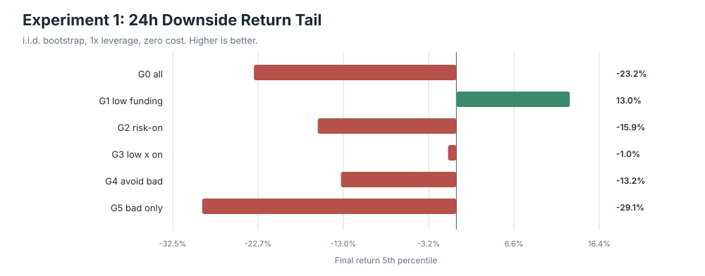
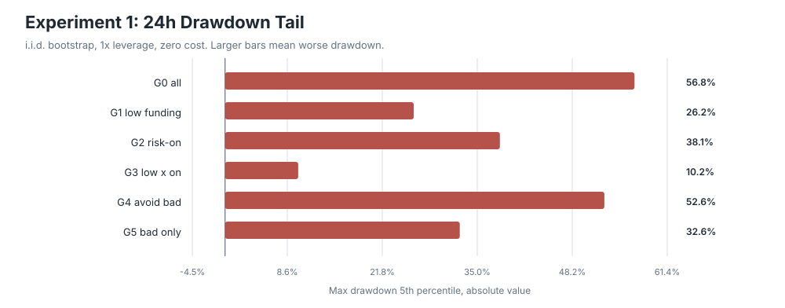
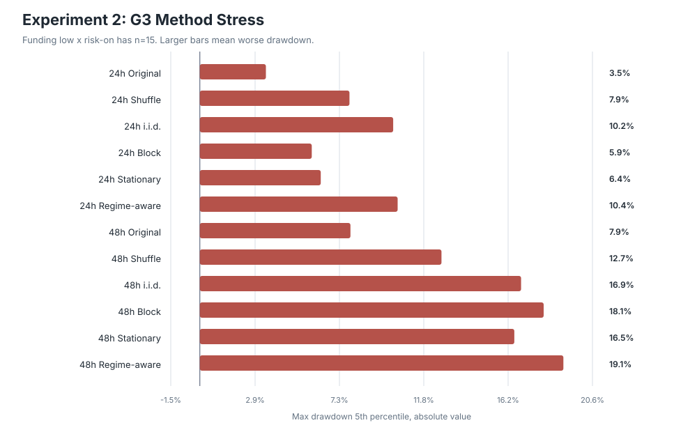
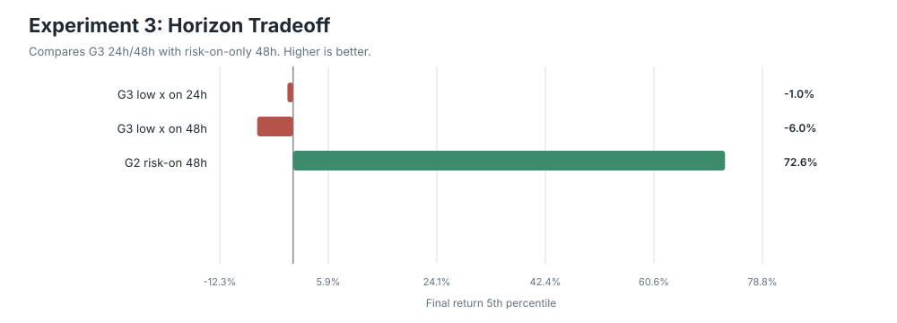
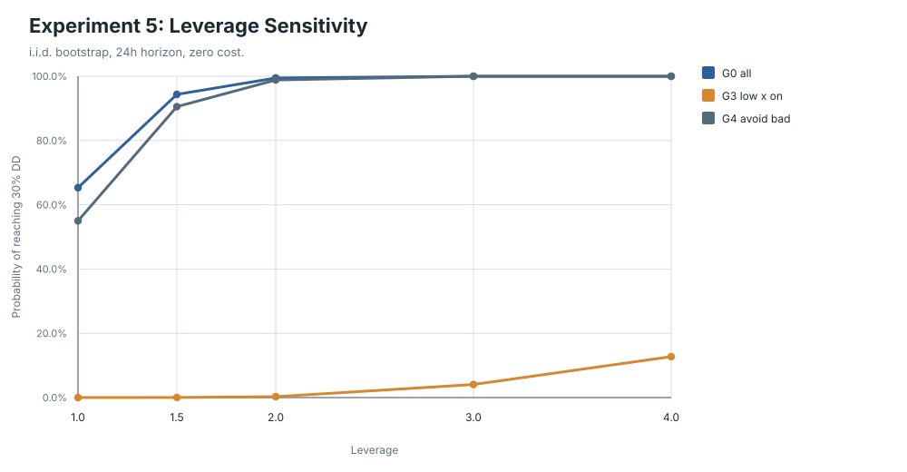
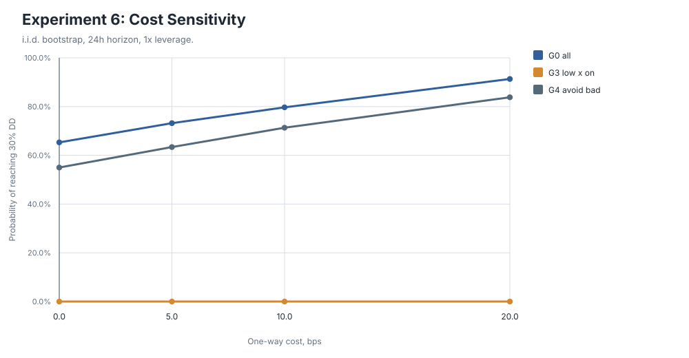

# lab_8 Monte Carlo Experiment Report

## Scope

This report tests whether the BTC crash filter candidate from lab_7 survives Monte Carlo stress.
All inputs are read from `lab_8/data`, and all generated artifacts are written under `lab_8/outputs/monte_carlo`.

This is an educational article experiment, not investment advice or a production trading system.

## Data and Parameters

| item | value |
| --- | --- |
| panel_rows | 13515.000 |
| panel_start | 2017-05-23 04:00:00 |
| panel_end | 2026-06-05 16:00:00 |
| rolling_sigma_window | 180.000 |
| cooldown_bars | 6.000 |
| n_sims | 5000.000 |
| seed | 20260609.000 |
| block_len | 5.000 |
| stationary_mean_block_len | 5.000 |

## Input Profile

| asset | file_name | clean_rows | start | end |
| --- | --- | --- | --- | --- |
| btc | BTCUSD240.csv | 17775 | 2017-05-23 00:00:00 | 2026-06-05 20:00:00 |
| nasdaq | USATECHIDXUSD240.csv | 19175 | 2013-05-22 12:00:00 | 2026-06-05 20:00:00 |
| sp500 | USA500IDXUSD240.csv | 19102 | 2013-05-23 00:00:00 | 2026-06-05 20:00:00 |
| dow | USA30IDXUSD240.csv | 19652 | 2013-05-23 00:00:00 | 2026-06-05 20:00:00 |
| dax | DEUIDXEUR240.csv | 19400 | 2013-05-21 12:00:00 | 2026-06-05 16:00:00 |
| BTCUSDT_funding | funding_rate_history.csv | 6354 | 2020-08-11 00:00:00 | 2026-05-29 16:00:00 |

## Group Definitions

| group | n_events |
| --- | --- |
| G0_all_crashes | 201 |
| G1_funding_low | 44 |
| G2_risk_on | 88 |
| G3_funding_low_x_risk_on | 15 |
| G4_avoid_high_funding_risk_off | 175 |
| G5_high_funding_x_risk_off | 26 |

## Visual Summary

These SVG figures are generated without external plotting libraries, so the experiment remains runnable with only `numpy` and `pandas`.

## Original Historical Order

| group | horizon | n_trades | mean_return_pct | win_rate_pct | profit_factor | final_return_pct | max_drawdown_pct | max_losing_streak |
| --- | --- | --- | --- | --- | --- | --- | --- | --- |
| G0_all_crashes | 24h | 201.000 | 0.423 | 53.234 | 1.332 | 98.407 | -30.823 | 7.000 |
| G1_funding_low | 24h | 44.000 | 1.343 | 63.636 | 2.688 | 73.898 | -19.097 | 5.000 |
| G2_risk_on | 24h | 88.000 | 0.484 | 54.545 | 1.476 | 45.119 | -27.800 | 6.000 |
| G3_funding_low_x_risk_on | 24h | 15.000 | 1.364 | 66.667 | 3.261 | 21.482 | -3.470 | 2.000 |
| G4_avoid_high_funding_risk_off | 24h | 175.000 | 0.514 | 54.857 | 1.413 | 111.315 | -32.982 | 6.000 |
| G5_high_funding_x_risk_off | 24h | 26.000 | -0.187 | 42.308 | 0.872 | -6.109 | -19.250 | 5.000 |
| G0_all_crashes | 48h | 201.000 | 0.739 | 61.194 | 1.468 | 236.213 | -42.441 | 5.000 |
| G1_funding_low | 48h | 44.000 | 1.038 | 68.182 | 1.646 | 46.820 | -23.468 | 3.000 |
| G2_risk_on | 48h | 88.000 | 1.540 | 67.045 | 2.522 | 252.212 | -16.394 | 4.000 |
| G3_funding_low_x_risk_on | 48h | 15.000 | 1.178 | 73.333 | 2.160 | 18.206 | -7.913 | 2.000 |
| G4_avoid_high_funding_risk_off | 48h | 175.000 | 0.854 | 62.286 | 1.537 | 245.086 | -42.441 | 4.000 |
| G5_high_funding_x_risk_off | 48h | 26.000 | -0.034 | 53.846 | 0.977 | -2.571 | -18.777 | 2.000 |

## Experiment 1: All Crashes vs Conditional Filters

The table below uses i.i.d. bootstrap summaries at 1x leverage and zero cost.

| group | horizon | n_trades | final_return_median_pct | final_return_q05_pct | mdd_median_pct | mdd_q05_pct | prob_dd_30_pct | prob_dd_50_pct | prob_halving_pct | max_losing_streak_q95 |
| --- | --- | --- | --- | --- | --- | --- | --- | --- | --- | --- |
| G0_all_crashes | 24h | 201.000 | 96.698 | -23.198 | -34.103 | -56.814 | 65.300 | 11.500 | 0.860 | 9.000 |
| G1_funding_low | 24h | 44.000 | 75.477 | 12.989 | -13.666 | -26.176 | 1.940 | 0.000 | 0.000 | 6.000 |
| G2_risk_on | 24h | 88.000 | 43.940 | -15.889 | -19.752 | -38.138 | 14.820 | 0.560 | 0.020 | 8.000 |
| G3_funding_low_x_risk_on | 24h | 15.000 | 20.966 | -0.962 | -4.549 | -10.158 | 0.000 | 0.000 | 0.000 | 4.000 |
| G4_avoid_high_funding_risk_off | 24h | 175.000 | 111.058 | -13.225 | -31.318 | -52.640 | 55.000 | 6.840 | 0.420 | 9.000 |
| G5_high_funding_x_risk_off | 24h | 26.000 | -6.036 | -29.126 | -17.147 | -32.571 | 8.240 | 0.020 | 0.000 | 9.000 |
| G0_all_crashes | 48h | 201.000 | 240.414 | -4.584 | -38.222 | -60.817 | 78.780 | 18.820 | 0.660 | 8.000 |
| G1_funding_low | 48h | 44.000 | 48.654 | -22.673 | -22.582 | -43.835 | 25.540 | 2.080 | 0.240 | 5.000 |
| G2_risk_on | 48h | 88.000 | 250.237 | 72.561 | -16.665 | -29.798 | 4.880 | 0.040 | 0.000 | 6.000 |
| G3_funding_low_x_risk_on | 48h | 15.000 | 18.933 | -6.035 | -7.178 | -16.876 | 0.060 | 0.000 | 0.000 | 4.000 |
| G4_avoid_high_funding_risk_off | 48h | 175.000 | 242.979 | 5.154 | -36.412 | -58.884 | 74.300 | 15.160 | 0.420 | 7.000 |
| G5_high_funding_x_risk_off | 48h | 26.000 | -2.601 | -28.410 | -16.943 | -33.287 | 8.680 | 0.060 | 0.020 | 7.000 |

## Experiment 2: Small-Sample Stress for G3

| method | horizon | n_trades | final_return_q05_pct | mdd_q05_pct | conditional_expected_drawdown_5_pct | prob_dd_30_pct | prob_halving_pct |
| --- | --- | --- | --- | --- | --- | --- | --- |
| block_bootstrap | 24h | 15.000 | 9.767 | -5.881 | -6.297 | 0.000 | 0.000 |
| iid_bootstrap | 24h | 15.000 | -0.962 | -10.158 | -12.136 | 0.000 | 0.000 |
| original_order | 24h | 15.000 | 21.482 | -3.470 | -3.470 | 0.000 | 0.000 |
| regime_aware_bootstrap | 24h | 15.000 | 2.021 | -10.392 | -11.933 | 0.000 | 0.000 |
| shuffle | 24h | 15.000 | 21.482 | -7.862 | -8.142 | 0.000 | 0.000 |
| stationary_bootstrap | 24h | 15.000 | 8.695 | -6.352 | -7.169 | 0.000 | 0.000 |
| block_bootstrap | 48h | 15.000 | -10.283 | -18.065 | -20.702 | 0.000 | 0.000 |
| iid_bootstrap | 48h | 15.000 | -6.035 | -16.876 | -20.500 | 0.060 | 0.000 |
| original_order | 48h | 15.000 | 18.206 | -7.913 | -7.913 | 0.000 | 0.000 |
| regime_aware_bootstrap | 48h | 15.000 | -1.614 | -19.098 | -21.346 | 0.000 | 0.000 |
| shuffle | 48h | 15.000 | 18.206 | -12.694 | -13.640 | 0.000 | 0.000 |
| stationary_bootstrap | 48h | 15.000 | -6.078 | -16.523 | -19.123 | 0.000 | 0.000 |

## Experiment 3: 24h Candidate vs 48h Risk-on

| group | horizon | n_trades | final_return_median_pct | final_return_q05_pct | mdd_q05_pct | prob_dd_30_pct | prob_halving_pct |
| --- | --- | --- | --- | --- | --- | --- | --- |
| G3_funding_low_x_risk_on | 24h | 15.000 | 20.966 | -0.962 | -10.158 | 0.000 | 0.000 |
| G2_risk_on | 48h | 88.000 | 250.237 | 72.561 | -29.798 | 4.880 | 0.000 |
| G3_funding_low_x_risk_on | 48h | 15.000 | 18.933 | -6.035 | -16.876 | 0.060 | 0.000 |

## Experiment 4: Avoiding High-Funding Risk-off Crashes

| group | horizon | n_trades | final_return_median_pct | final_return_q05_pct | mdd_median_pct | mdd_q05_pct | prob_dd_30_pct | prob_halving_pct |
| --- | --- | --- | --- | --- | --- | --- | --- | --- |
| G0_all_crashes | 24h | 201.000 | 96.698 | -23.198 | -34.103 | -56.814 | 65.300 | 0.860 |
| G4_avoid_high_funding_risk_off | 24h | 175.000 | 111.058 | -13.225 | -31.318 | -52.640 | 55.000 | 0.420 |
| G5_high_funding_x_risk_off | 24h | 26.000 | -6.036 | -29.126 | -17.147 | -32.571 | 8.240 | 0.000 |
| G0_all_crashes | 48h | 201.000 | 240.414 | -4.584 | -38.222 | -60.817 | 78.780 | 0.660 |
| G4_avoid_high_funding_risk_off | 48h | 175.000 | 242.979 | 5.154 | -36.412 | -58.884 | 74.300 | 0.420 |
| G5_high_funding_x_risk_off | 48h | 26.000 | -2.601 | -28.410 | -16.943 | -33.287 | 8.680 | 0.020 |

## Experiment 5: Leverage Sensitivity

| group | horizon | leverage | final_return_q05_pct | mdd_q05_pct | prob_dd_30_pct | prob_dd_50_pct | prob_halving_pct | prob_ruin_pct |
| --- | --- | --- | --- | --- | --- | --- | --- | --- |
| G0_all_crashes | 24h | 1.000 | -23.198 | -56.814 | 65.300 | 11.500 | 0.860 | 0.000 |
| G0_all_crashes | 24h | 1.500 | -42.443 | -73.920 | 94.360 | 44.720 | 3.420 | 0.000 |
| G0_all_crashes | 24h | 2.000 | -59.938 | -84.562 | 99.460 | 74.580 | 6.960 | 0.000 |
| G0_all_crashes | 24h | 3.000 | -85.787 | -95.834 | 100.000 | 97.620 | 16.660 | 0.000 |
| G0_all_crashes | 24h | 4.000 | -96.781 | -99.334 | 100.000 | 99.940 | 29.340 | 0.000 |
| G3_funding_low_x_risk_on | 24h | 1.000 | -0.962 | -10.158 | 0.000 | 0.000 | 0.000 | 0.000 |
| G3_funding_low_x_risk_on | 24h | 1.500 | -1.205 | -15.147 | 0.020 | 0.000 | 0.000 | 0.000 |
| G3_funding_low_x_risk_on | 24h | 2.000 | -3.373 | -20.134 | 0.280 | 0.000 | 0.000 | 0.000 |
| G3_funding_low_x_risk_on | 24h | 3.000 | -6.239 | -28.702 | 4.080 | 0.020 | 0.000 | 0.000 |
| G3_funding_low_x_risk_on | 24h | 4.000 | -10.467 | -36.719 | 12.740 | 0.440 | 0.140 | 0.000 |
| G4_avoid_high_funding_risk_off | 24h | 1.000 | -13.225 | -52.640 | 55.000 | 6.840 | 0.420 | 0.000 |
| G4_avoid_high_funding_risk_off | 24h | 1.500 | -29.582 | -69.345 | 90.540 | 35.120 | 1.980 | 0.000 |
| G4_avoid_high_funding_risk_off | 24h | 2.000 | -50.215 | -81.847 | 98.840 | 67.200 | 5.040 | 0.000 |
| G4_avoid_high_funding_risk_off | 24h | 3.000 | -77.971 | -94.346 | 100.000 | 96.300 | 12.280 | 0.000 |
| G4_avoid_high_funding_risk_off | 24h | 4.000 | -93.334 | -98.781 | 100.000 | 99.780 | 21.760 | 0.000 |

## Experiment 6: Cost Sensitivity

Costs are one-way bps. The simulation subtracts a round-trip cost of `2 * one_way_cost_bps` from each trade before leverage.

| group | horizon | one_way_cost_bps | final_return_q05_pct | mdd_q05_pct | prob_dd_30_pct | prob_halving_pct |
| --- | --- | --- | --- | --- | --- | --- |
| G0_all_crashes | 24h | 0.000 | -23.198 | -56.814 | 65.300 | 0.860 |
| G0_all_crashes | 24h | 5.000 | -39.208 | -61.086 | 73.180 | 2.260 |
| G0_all_crashes | 24h | 10.000 | -46.306 | -64.874 | 79.680 | 4.120 |
| G0_all_crashes | 24h | 20.000 | -66.548 | -73.947 | 91.340 | 16.700 |
| G3_funding_low_x_risk_on | 24h | 0.000 | -0.962 | -10.158 | 0.000 | 0.000 |
| G3_funding_low_x_risk_on | 24h | 5.000 | -2.713 | -10.688 | 0.000 | 0.000 |
| G3_funding_low_x_risk_on | 24h | 10.000 | -3.171 | -11.548 | 0.000 | 0.000 |
| G3_funding_low_x_risk_on | 24h | 20.000 | -6.470 | -13.090 | 0.000 | 0.000 |
| G4_avoid_high_funding_risk_off | 24h | 0.000 | -13.225 | -52.640 | 55.000 | 0.420 |
| G4_avoid_high_funding_risk_off | 24h | 5.000 | -28.875 | -56.256 | 63.380 | 1.040 |
| G4_avoid_high_funding_risk_off | 24h | 10.000 | -41.655 | -60.883 | 71.320 | 2.580 |
| G4_avoid_high_funding_risk_off | 24h | 20.000 | -57.778 | -68.116 | 83.820 | 8.780 |

## Output Files

- `data_profile.csv`: input data profile.
- `feature_panel.csv`: full timestamp panel with crash, funding, risk-on, and future-return fields.
- `trade_events.csv`: cooldown-filtered BTC crash event table used by Monte Carlo.
- `original_trade_metrics.csv`: historical-order metrics by group, horizon, and cost.
- `monte_carlo_summary.csv`: all main method summaries at 1x leverage and zero cost.
- `experiment1_group_comparison.csv` through `experiment6_cost_sensitivity.csv`: article-focused experiment slices.
- `figure_index.csv`: generated SVG figure inventory.
- `figures/*.svg`: explanatory charts for article use.
- `experiment_metadata.json`: reproducibility parameters.

## Interpretation Notes

- G3 has only 15 trades, so a good original-order drawdown is not enough to claim deployability.
- Shuffle tests order risk, while i.i.d. bootstrap tests sample uncertainty.
- Block and stationary bootstraps keep some loss-cluster structure.
- Regime-aware bootstrap samples within year/risk/funding labels, preserving the original regime sequence.
- Leveraged returns are simple returns after round-trip cost, multiplied by leverage. A trade return <= -100% is treated as ruin.
